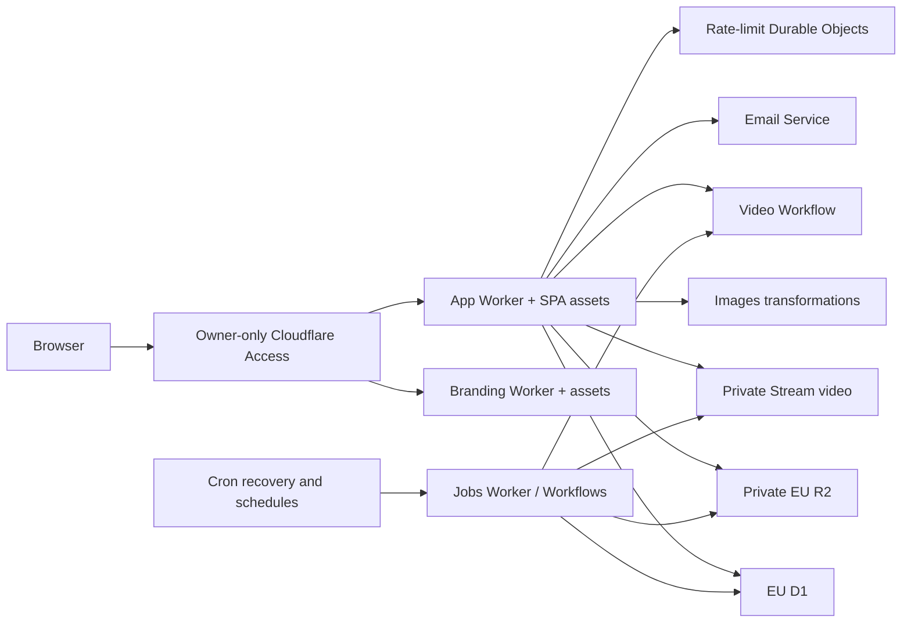

# Architecture

How the workspaces fit together and what actually happens at runtime. For
"where do I make this change", start from [CONTEXT.md](../CONTEXT.md); for
behaviour and vocabulary, [product.md](product.md).

## Workspace ownership and dependency direction

**Source of truth:** `pnpm-workspace.yaml`, each package's `package.json`,
`turbo.json`

Dependencies point one way. `apps/web`, `apps/server` and `apps/jobs` are leaves; nothing
imports them.

```
apps/web ──▶ packages/api, packages/auth (browser-safe subpaths only)
apps/server ──▶ packages/api ──▶ packages/auth ──▶ packages/db
            └─▶ packages/auth ─────────────────────┘
            └─▶ packages/db
e2e ──▶ packages/api, packages/auth, packages/db
apps/jobs ──▶ packages/api/cloudflare-jobs, packages/db
```

`packages/api`, `packages/auth` and `packages/db` export TypeScript source.
Wrangler bundles them for Workers; local maintenance and test tools use tsx or
fixture bundling. The browser may import only the dependency-free subpaths listed
in [root context](../CONTEXT.md#cross-cutting-invariants). It never imports a D1
client or constructs an auth instance.

## Development topology

**Source of truth:** `apps/web/vite.config.ts`, `apps/server/src/e2e-server.ts`,
`e2e/playwright.config.ts`

Native E2E runs Vite on `:5273` with its Worker gateway on `:3101`. The gateway
composes real app, D1, R2, Durable Objects and video Workflow code with synthetic
Access, email and Stream transport. Each test database/bucket is isolated and
ends in `_test`; no production selectors or credentials enter this stack.

Interactive `pnpm dev` currently starts Vite on `:5173` and low-level Wrangler on
`:3001`. Its loopback composition remains incomplete: the deployment entrypoint
requires its PoC host, Access assertion and secrets. `pnpm jobs:dev` starts jobs
separately; sharing the app's local persistence for recovery remains to wire.
Vite proxies `/rpc`, `/api/auth` and `/media` to `RPC_TARGET`. Only public build
inputs come from the root Vite environment; maintenance tools bind D1/R2 directly.

## Production topology — one origin

**Source of truth:** `apps/server/wrangler.jsonc`, `apps/server/worker/index.ts`,
`apps/branding/wrangler.jsonc`, `apps/jobs/wrangler.jsonc`

This is the isolated PoC's intended hosted topology. It has not yet been deployed;
Railway production continues independently.



The app serves SPA, auth, RPC and media on `cf-poc.mytuums.com`, preserving relative
`/rpc` and `/media` URLs. The separate branding Worker serves
`about-cf-poc.mytuums.com`. Both validate Access before serving assets, disable
public workers.dev/preview URLs, and mark responses private/no-store and noindex.

Jobs dispatch durable D1 intents and coordinate Stream processing, staged game
catalog publication and pruning. Provider requests happen outside atomic D1
batches. No queue, database migration or video encoding runs inside an HTTP
request. Video source/encoding is owned by Stream; images and game covers use R2.

## HTTP route order and access gates

**Source of truth:** `apps/server/src/worker-request-handler.ts`

Every response carries a generated `x-request-id`. Exact host, Access and trusted
edge identity admission precede dispatch, including health and static assets.

| Order | Match                          | Gate                                                                    |
| ----- | ------------------------------ | ----------------------------------------------------------------------- |
| 1     | `GET /health`                  | D1 health after Access                                                  |
| 2     | normalized `/api/auth/admin/*` | always 404                                                              |
| 3     | `/api/auth`                    | bounded lazy body, Better Auth admission and dispatch                   |
| 4     | `/rpc`                         | declared/actual byte caps, large-body session gate, bounded concurrency |
| 5     | `/media`                       | GET/HEAD, current per-key authorization                                 |
| 6     | documents                      | shared signed-out allowlist, otherwise app-session page gate            |
| 7     | assets                         | explicit asset binding lookup; no implicit SPA fallback                 |
| 8     | missing/fault                  | private 404/500 with content-free event                                 |

Media authorization runs before I/O and again before delivery; session-store
failure denies media. Only the page shell retains its fail-open presentation
rule. Admin plugin endpoints remain inaccessible, keeping moderation behind RPC
hierarchy and audit guards. Auth rate limiting precedes body reads; failed or
unused request bodies are cancelled. Detailed limits and native regression
coverage are in [Worker context](../apps/server/worker/CONTEXT.md).

## oRPC context

**Source of truth:** `packages/api/src/context.ts`, `packages/api/src/procedures.ts`,
`packages/api/src/router.ts`

`createContext` builds one `Context` per request carrying `db`, `session`,
`rateLimiter`, `storage`, `videoUploads` and `requestId`. The rate limiter and the storage
client are threaded on the context, never imported as module globals, so tests
substitute fakes and one suite's limiter state cannot bleed into another's.

The router's top-level groups:

<!-- docs:check=router-groups -->

- `me` — the caller's own session user
- `post` — `create`, `delete`, `list`, `thread`, `like`, `unlike`
- `video` — native Stream begin/status/finish/cancel and author-only pending submissions
- `user` — `byUsername`, `uploadImage`, `removeImage`, `follow`, `unfollow`, `followers`, `following`
- `game` — `bySlug`, `list` (public: the `/games` directory, issue #314)
- `search` — `typeahead`, `users`, `posts`
- `notification` — `list`, `unreadCount`, `markRead`
- `moderation` — reports, blocks, the queue, the staff actions, the audit log, appeals

There is deliberately no RPC-level health check; liveness is plain HTTP at
`/health`.

Procedures are built from four gates in `packages/api/src/procedures.ts`:
`protectedProcedure` (session required), `moderatorProcedure`,
`staffProcedure`, `adminProcedure` — plus `baseProcedure`, used by exactly one
procedure (`moderation.appealOpen`). See [security.md](security.md).

## Client state ownership — Jotai and TanStack Query

**Source of truth:** `apps/web/src/lib/store.ts`, `apps/web/src/lib/query-client.ts`,
`apps/web/src/main.tsx`, `apps/web/src/atoms`

One store, one QueryClient, one router — created at module scope, never inside
a component:

- `apps/web/src/lib/query-client.ts` exports the single `QueryClient`.
- `apps/web/src/lib/store.ts` exports the single Jotai store, hydrated with
  `queryClientAtom` at module scope rather than through `useHydrateAtoms`. Two
  QueryClients would silently split mutation `scope` serialisation.
- Every server-data atom wraps the oRPC utils through `jotai-tanstack-query`.
  `apps/web/src/atoms/post-feed.ts` is the house style.
- Router-touching work (gates, redirects) lives in `apps/web/src/hooks`, never
  in an atom: importing the router from an atom creates a cycle through
  `main.tsx`.

oRPC embeds the whole input object in query keys, so the conditional spreads in
the feed and user-list atoms are what keep the global feed's key bare — and the
optimistic like/follow sweeps in `apps/web/src/lib/post-cache.ts` match on
those exact prefixes.

## Auth and sessions

**Source of truth:** `packages/auth/src/index.ts`, `packages/auth/src/social.ts`,
`packages/auth/src/env.ts`, `apps/web/src/lib/auth-client.ts`

One better-auth instance serves the whole app, mounted at `/api/auth` by
`apps/server/worker/application.ts`. Plugins: username, twoFactor, passkey, oneTap,
lastLoginMethod, admin, i18n. `trustedOrigins` is `[webOrigin]` only.

Session resolution goes through `auth.api.getSession` on every request — there
is deliberately no session cookie cache, because a revoked session must stop
authenticating immediately.

User-field rules are enforced by the `databaseHooks` in
`packages/auth/src/dob.ts`, `packages/auth/src/profile.ts` and
`packages/auth/src/legal.ts` — the only place they hold, because these columns
are bare `text` and the browser's checks are skippable. Those hooks are thin:
the rules themselves live in
`packages/auth/src/rules.ts`, which the browser reads too, so the hook and the
form cannot come to disagree about what a valid handle, bio or date of birth
is. What stays in the hooks is what only a server does — turning a violation
into an `APIError`, permitting an absent date of birth (OAuth sign-ups arrive
with none), requiring legal acceptance on the email/password sign-up path
(`create.before` only — the update hook has to stay open for the writes
sign-up makes to its own row), and refusing the client image writes only the
upload procedure may make.

Legal acceptance is the one rule with a second enforcement point, because the
hook cannot reach every account that needs it: an OAuth or passkey sign-up has
nowhere to present a checkbox, so it creates an account before anyone can be
asked, and accounts predating the record have the same shape. So
`protectedProcedure` in `packages/api/src/procedures.ts` refuses any caller
whose record is absent or names a superseded version. The two enforcement
points read one predicate — `hasCurrentLegalConsent` in
`packages/auth/src/rules.ts` — which the web app's consent dialog reads too, so
the hook, the gate and the browser cannot disagree about who still owes an
acceptance. Everything that gate leaves reachable sits outside oRPC on
purpose: accepting and the `/welcome` claim go through the auth client, and
signing out and reading the documents touch no procedure at all.

**Build-time versus runtime OAuth configuration** is the subtlety worth
knowing. The server registers a provider only when _both_ halves of its
credential pair exist (`packages/auth/src/social.ts`). The browser cannot read
server env, so the button list comes from `VITE_SOCIAL_PROVIDERS`, which Vite
inlines into the bundle **at build time** — inside the Docker build, via
`ARG`. The two lists are kept in agreement by hand and asserted from both
sides by CI. See [operations.md](operations.md).

## Media — upload, retrieval, reconciliation

**Source of truth:** `packages/api/src/profile-media.ts`,
`packages/api/src/image.ts`, `packages/api/src/storage.ts`,
`packages/api/src/media.ts`, `packages/api/src/reconcile-media.ts`,
`apps/web/src/lib/media.ts`

- **Crop is baked, not stored.** The browser re-encodes every picked file into
  a display variant (`apps/web/src/lib/media.ts`) and uploads it beside the
  untouched original. The crop/reposition editor
  (`apps/web/src/components/settings/image-crop-dialog.tsx`) chooses the
  visible region _before_ that encode, so the choice lands in the display
  object's pixels — there is deliberately **no crop column and no server-side
  crop state**. Everything that renders a profile image reads the same display
  object, which is what makes the crop consistent across the profile, header,
  post cards and settings preview for free. Re-cropping means re-uploading;
  the retained original is what makes that lossless. The server is unaffected:
  it validates the display object on its own bounds, exactly as before.
- **Avatars have a canonical 1:1 composition.** The crop editor and encoder
  share `calculateCropFrame`, which selects the same centered square at zoom 1
  for portrait and landscape sources. Applying an untouched crop therefore
  matches the no-crop encode, while pan and zoom change the square that every
  avatar surface renders without a second hidden `object-cover` crop. Only the
  display variant is square-cropped; the original remains untouched for a
  future refit. The stored variant can reach 1024x1024 because the profile
  page's full-size viewer renders this same object at near-viewport scale —
  feeds still downscale it (issue #229).
- **Avatars uploaded before #233 stay at 512 px until their owner re-crops
  them.** The ceiling raise only changed the encode path, so every display
  variant already in the bucket predates it, and profile media persist no
  dimensions to notice that from — detection measures the display object in
  the browser against the live `IMAGE_LIMITS.avatar` ceiling
  (`apps/web/src/lib/avatar-upgrade.ts`). The owner is offered a one-click
  re-crop on their own profile (`apps/web/src/components/avatar-upgrade-prompt.tsx`),
  seeded from the retained original and running the ordinary upload pipeline —
  never a server-side or silent re-encode, which would recompose the stored
  crop. Dismissal persists per browser against the dismissed display path, so
  a new upload re-evaluates from scratch (issue #246).
- **Banners have one canonical 3:1 composition.** At zoom 1 the editor
  rectangle is exactly the region the encoder stores (`calculateCropFrame`),
  so applying without adjusting anything is a no-op. That rectangle is also
  the peak of the zoom range: it already spans the source's full width or
  full height — the largest 3:1 window that fits — so the window never leaves
  the source; zoom only goes in, and drag pans within it (issue #273). The
  profile frame displays that one composition with its height clamped
  (`apps/web/src/lib/banner-frame.ts`): exact 3:1 wherever the measure holds,
  a 150px band on narrow phones, never taller than 320px past the 1500px
  measure — so extreme viewports trim bounded edges of the composition
  instead of re-choosing the crop. In the editor the outlined rectangle is the
  fixed, actual region being encoded: the source context starts visible around
  it, dragging moves the image beneath it, and wheel zoom scales the image.
  Pointer movement is coalesced to one compositor transform per animation
  frame and rebased after each clamp, so large source previews do not trigger
  layout per raw event or stick when a drag reverses from an edge. The stored
  variant can reach 3840x1280 for a sharp 2x sample on a 1920px display.
- **The pre-decode guards run at file pick, not just at encode.**
  `validateImageFile` owns the type, byte-cap and header megapixel checks, and
  the editor calls it before it decodes anything. The megapixel ceiling is the
  load-bearing one: a ~200 KB PNG declaring 400 MP allocates about a gigabyte
  on decode, so an editor that measured the source first would freeze the tab
  merely on selection.
- **Post image attachments are re-encoded in the browser and keep no original**
  (issue #207). The composer runs every picked file through
  `createPostAttachment` (`apps/web/src/lib/media.ts`) before it joins a
  draft: decode → canvas re-encode to WebP (PNG where a browser lacks that
  encoder) bounded by the server's own attachment caps — never upscaled, at
  most 4096 px per side, shrunk until within `POST_ATTACHMENT_MAX_BYTES`.
  Unlike profile media there is deliberately no `.orig` twin: posts are
  feed-wide content any signed-in viewer can fetch, so the only stored object
  is the re-encoded one — and a canvas encode emits pixels only, which is
  what strips EXIF/GPS metadata by construction. Profile originals keep their
  metadata on purpose; post attachments cannot have any. The server still
  validates whatever arrives (`packages/api/src/post-image.ts`); the client
  pipeline is the cooperative path, not the boundary.
- **Lifecycle.** `user.uploadImage` and `user.removeImage` are thin
  procedures over `packages/api/src/profile-media.ts`, which owns the whole
  avatar/banner lifecycle: register the immutable pair in a 30-minute upload
  intent, write both objects, then publish their references and consume the
  live intent in one D1 batch. Database triggers record the actual superseded
  pair in the same transaction, including concurrent replacements and account
  deletion. Cleanup follows commit; failures retain durable debt for retry.
  An expired upload cannot publish. An ambiguous database acknowledgement must
  never cause deletion of freshly uploaded objects, since publication may have
  committed. Reconciliation lists objects before taking one SQL snapshot of
  pending and published image references; it also catches late writes after
  upload expiry. Native storage adapters and scheduled recovery remain pending
  on this migration branch.
- **Upload.** `user.uploadImage` accepts bytes, sniffs the actual type rather
  than trusting the declared one (`sniffImageType`), parses dimensions from the
  header (`packages/api/src/dimensions.ts`), and enforces per-slot byte and
  megapixel bounds. The display variant and the untouched original share one
  uuid, distinguished by an `.orig` infix. The row is written **before** the
  old object is deleted.
- **Retrieval.** The stored value is a relative `/media/<key>` path. The
  server authorizes the key (a null viewer for the anonymous permalink
  reader), then `createMediaResolver` returns a presigned URL and — when a
  key's redirect may be stored — its Cache-Control; the response is a 302
  that is `private, no-store` by default, because every redirect is a
  viewer-authorized decision. A key carrying a variant marker
  (`…/uuid.png.w640.webp`) is authorized against its BASE — the path the rows
  store — and served from the variant object `media-variants.ts` generates on
  first request (sharp resize to a fixed width, WebP, written back under the
  bucket's immutable caching); the browser reaches it through the `srcset`
  the shared `MEDIA_VARIANT_WIDTHS` builds. Profile **display** objects are
  the one exemption: their redirect is cached
  `private, max-age=<secondsUntilWindowEnd()>`, bounded so it can never
  outlive the signature it points at. Presigned URLs remain **windowed**
  (`MEDIA_SIGNING_WINDOW_MS`, 30 minutes) — byte-identical within a window,
  which is what keeps repeat views off the bucket either way.
- **Reconciliation.** The reconciler deletes objects with no live reference or
  upload intent. It lists the bucket **before** reading all pending and published
  image references in one SQL snapshot — separate reads could miss an upload
  committing between them. The legacy `reconcile:media` command still needs
  native binding configuration on this branch. A derived
  variant is referenced exactly while its base is: the pairing rule adds
  every derivable variant key of each referenced base, so on-demand
  generation never orphans a survivor and a dead base's variants are reaped
  with it.

### Video lifecycle and playback

**Source of truth:** `packages/api/src/video-uploads.ts`,
`packages/api/src/video-lifecycle.ts`, `packages/api/src/stream-publication.ts`,
`packages/api/src/stream-processing.ts`, `packages/api/src/video-media.ts`,
`packages/api/src/stream.ts`, `apps/web/src/components/video-player.tsx`.

The native domain and media adapters, Workflow polling, caption handoff and
scheduled recovery are implemented and tested locally. The FFmpeg application
has been removed from this branch. Application composition includes video routing;
the deployable entrypoint and hosted validation remain outstanding.

1. A D1 owner/creator record precedes Stream creation. Only its author can obtain
   the tus upload capability, which expires after 24 hours. The browser resumes
   sequential 8 MiB PATCH requests from Stream's HEAD-confirmed byte offset.
   Local preview remains independent of upload completion and publication consent.
2. Completion verifies authenticated provider upload status and creates no post.
   Explicit submission commits private text, queued state, a 30-minute deadline
   and an IDs-only Workflow intent. Dispatch follows commit; recovery retries
   ambiguous acknowledgements under the same stable instance ID.
3. Authenticated processing must produce valid Stream dimensions and duration
   before `recordStreamReady`. Captions, when present, must finish their provider
   upload before that transition. There is no local FFmpeg derivative inventory
   or source-deletion guarantee in the native schema.
4. Publication latches author/target/deadline eligibility in the first D1 batch
   statement. That same transaction inserts the ordinary post, attachment and
   notifications, attaches the post ID and removes the private submission.
   No clock is rechecked between those effects; duplicate delivery cannot publish
   twice. The attachment size is the accepted upload size, not encoded storage.
5. Failure commits one link-free notice, pending-text erasure and cleanup debt.
   Cancellation, account/post deletion and expiry also owe cleanup. Recovery
   lists unknown provider UIDs by exact creator identity and keeps empty records
   for 24 hours to catch late creation visibility; failed deletions retain debt.

Media routes require a published video and the existing post authorizer. Token
issuance rechecks authorization after provider I/O. Native Stream bearer tokens
last one hour; direct HLS segments and thumbnails do not revisit Access or the
application during that window. There is no source-download route. Captions are
fetched privately with a 1 MiB limit. A bounded VTT index points at two-second,
individually authorized Stream thumbnails, replacing encoded preview sprites.

The player retains its single-visible-owner, autoplay, controls and fullscreen
behavior. HLS.js learns available quality levels from Stream's manifest; native
HLS fallback lets the browser manage adaptation. No database rendition filename
is constructed. Actual playback, caption alignment and thumbnail behavior still
need the Access-protected deployed checks.

## Moderation — report, action, audit, appeal

**Source of truth:** `packages/api/src/moderation.ts`,
`packages/api/src/moderation-queue.ts`, `packages/api/src/appeal-intake.ts`,
`packages/api/src/moderation-appeals.ts`, `packages/api/src/appeal-review.ts`,
`packages/api/src/moderation-actions.ts`, `packages/api/src/moderation-post.ts`,
`packages/api/src/moderation-user.ts`, `packages/db/src/schema/app.ts`

1. **Report.** `moderation.report` writes a row keyed
   `(reporterId, targetType, targetId)`. A repeat report refreshes the
   timestamp and keeps the first reason, so a resolved case reopens.
2. **Queue.** `moderation.queue` merges unresolved report groups with open
   appeals in JS behind a single keyset cursor. It is the one paginated list
   that does not go through `keysetPage`, because the merge does not fit the
   single-query skeleton; each side carries a correlated not-exists exclusion
   so a dual report-and-appeal case is never emitted twice. Each case then
   carries a `preview` of its target — the reported post's author and a
   bounded excerpt, or the reported account and its effective ban state —
   loaded for the page after the merge and the slice, so a row says which
   case to open rather than only how many are waiting.
3. **Action.** Removals and suspensions are `moderatorProcedure`; bans, role
   changes, the team view and audit log are `staffProcedure`. The wrappers in
   `packages/api/src/moderation-actions.ts` call guarded D1 batches owned by
   `moderation-post.ts` and `moderation-user.ts`. Each batch owns state checks,
   report stamps, session revocation where applicable, the audit and in-app
   notice. Wrappers send the owed email only after the batch commits.
4. **Audit.** `moderation_action` is append-only. Conditional audit inserts
   record the actual state being changed, and their new IDs gate dependent
   writes. D1 serializes the whole batch: a losing concurrent restore cannot
   create another audit or notice. A role restore checks both the contested
   grant and the reviewer's ability to manage the held and restored roles.
   Any failed statement rolls back all preceding effects; no email is sent
   before commit. Email retry durability remains migration work.
5. **Appeal intake.** `moderation.appealOpen` delegates to
   `packages/api/src/appeal-intake.ts`. The HMAC email link works signed out;
   the removed-post stub requires the author's session. Each adapter proves
   its capability and spends its own budget before normalizing to an action,
   appellant and nonce. One D1 batch conditionally inserts and reads the
   refusal if no row was created. The insert checks appealability, ownership,
   current/latest state and prior appeals. Nonce reuse takes precedence over
   an action match; a final review prevents fresh-link retries too. Shared
   current/latest SQL lives in `moderation-action-state.ts`; suspension expiry
   is evaluated against the database clock. Unique indexes remain the backstop.
6. **Appeal review.** `moderation.appealReview` delegates to `appeal-review.ts`.
   A preliminary read chooses the inverse statements; the batch rechecks open
   status, original actor, current/latest action state and target rank. It
   composes the inverse with the review stamp, `appeal_resolved` audit and
   both notices. The inverse's audit ID gates the resolution because the
   original action is no longer current after its reversal. Upholding checks
   latest state but needs no inverse. Only the winner sends post-commit email.
   A late error rolls everything back; an overturn that changes nothing is
   refused. Forward sanctions close older appeals in their control family as
   `superseded` within their own batch.
7. **Manual reversal.** Restoring a post, lifting a sanction or changing a
   contested role stamps that family's open appeals `reversed` in the same
   D1 batch. Review fields stay empty and no `appeal_resolved` row is invented.
   Author-deleted legacy posts instead have open appeals withdrawn before a
   moderation refusal, so they cannot leave an unresolvable queue item.

## Game catalog publication

**Source of truth:** `packages/api/src/game-catalog.ts`,
`packages/api/src/games-sync.ts`, `packages/api/src/game-media.ts`

The sync acquires a 30-minute D1 lease before reading the current catalog or
fetching Twitch/IGDB. It stages a complete validated catalog in invisible version
rows. Publication checks the lease, expected row count, permanent hashtag keys,
retained game IDs and any new cover's upload intent. A single D1 batch stamps
the version, updates the indexed live game table, switches the active-version
pointer and consumes published upload intents. A failure rolls back that whole
transition; concurrent requests see a complete catalog. Favorites reference the
permanent game IDs, and publication preserves counts and creation timestamps.

A replacement publisher fences an expired run. Replaying an already active
version succeeds without republishing it. Cleanup removes up to 250 obsolete
staged rows and ten empty versions per pass, protecting active and running
versions. The future jobs Worker must schedule those recovery passes.

New cover paths contain a catalog version token. Unchanged covers are retained;
a later return to an older IGDB image gets a new path. Upload intents protect
storage writes before publication, and triggers record replaced cover paths in
the publication transaction. Failed storage deletions remain retryable. The
shared image reconciler reads game covers and pending intents alongside other
image references, after listing the bucket. Native bindings and Workflow step
integration are still pending on this migration branch.

## Text search

**Source of truth:** `packages/api/src/search-text.ts`,
`packages/api/scripts/generate-case-folding.ts`

`packages/api/src/search-text.ts` owns literal substring matching shared by users,
posts and games. D1's ASCII-only `lower()` is combined with Unicode 17 simple-case
variants for the characters present in the query, then `INSTR` matches the whole
literal string. Short alphabets use direct replacements; longer ones use a bound
JSON sequence in a recursive SQL expression, preserving the existing 100-character
input limit without exceeding D1's parameter or LIKE/GLOB limits. Matching remains
inside the query with visibility and keyset pagination, so it cannot drop matches
by filtering an already limited page. Canonical ASCII handles instead use an
indexable prefix range; relevance still ranks exact handles before prefixes.
Combining that range with unindexed display-name alternatives still scans users.

Case data is generated from pinned Unicode source, with a checksum and accompanying
license. No stored copy of normalized user/post/game text needs synchronization.
Accents and code-point count are significant: ß matches ẞ, while SS is different;
there is no accent stripping, Unicode normalization or locale-specific casing.
Substring searches still scan candidate text. Deployment measurements must include
long queries and non-Latin text before assessing the production cost.

## Ranked feeds

**Source of truth:** `packages/api/src/feed-rank.ts`,
`packages/api/src/posts.ts` (`post.list`'s ranked branch), `packages/api/src/cursor.ts`
(`createRankCursorCodec`), `packages/db/src/schema/app.ts` (`feedRankSnapshot`)

The home **For you** (`global`), **Following**, and **Discover** feeds are
ranked by one scorer over three candidate sets — no ML, no model serving, no
separate infrastructure. The issue's framing cited X's public ranking code as
inspiration; this implementation does not reproduce it. The
[2023 release](https://github.com/twitter/the-algorithm) described a roughly
48-million-parameter MaskNet ranker, not 48 engagement features. The newer
[2026 release](https://github.com/xai-org/x-algorithm) describes Phoenix,
a transformer-based ranker. Those models predict viewer actions rather than
multiply raw engagement counts; public code does not reproduce the complete
live service. What carries over is the broad shape of sourcing, scoring and
filtering candidates. MyTuums adds a frozen serving
order — at this app's scale: bounded SQL queries source the candidates, one
pure JS function scores them, and a snapshot freezes the order for paging.

1. **Candidate sourcing (bounded SQL).** Two arms per scope: authored
   top-level posts, plus repost events scored on the original's features with
   the event's timestamp for freshness. Following carries only the viewer's
   and followed accounts' amplifications; global and Discover take any visible
   reposter. Discover excludes the viewer's own originals but includes followed authors'
   posts. Candidates are top-level, non-tombstoned posts inside a 7-day
   window, widened to 30 days only when the 7-day pool holds fewer than
   `FEED_RANK_SPARSE_THRESHOLD` rankable candidates; the pool is capped at
   `FEED_RANK_POOL_LIMIT` (500, across both arms — never per arm), and each
   history signal is bounded by `FEED_RANK_HISTORY_LIMIT` (200) so an old
   account costs the same as a new one. Tombstoned (removed or deleted) rows
   never rank, and every history input is filtered to currently visible rows —
   hidden content lends no affinity and no topics, and bookmarks are never
   read. The hashtag scan mirrors the client's linkifier charset and
   boundaries, and the game filter's SQL prefilter is a superset re-checked
   exactly in JS. A SQLite row-number partition selects each original's latest
   visible repost before limiting, so viral activity cannot consume the whole
   candidate budget. ID sets use JSON parameters within D1's binding limit.
   Scoring is pure JS over these candidates, never a duplicated
   SQL formula: one `scorePost` owns the weights.
2. **Scoring (one pure function).** `scorePost` weights capped categories in
   priority order — favorite-game overlap (12), like affinity (7), the follow
   edge (5), repost affinity and reply-topic interest (3 each), log-scaled and
   capped popularity (3 total) — with exponential freshness decay off an
   hourly-bucketed clock so scores stay identical across pages. Replying
   anywhere in a thread counts as topic interest via a depth-bounded thread
   walk (root plus immediate parent per thread); the thread's author earns no
   endorsement from it. The repeated-author penalty (`1 / (1 + n * 0.12)`)
   applies after the pure score orders the pool: mild, deterministic, never a
   hard cap — the pure score never knows about it.
3. **Serving (frozen snapshot).** The first ranked page builds and persists a
   `feedRankSnapshot` row — ordered IDs with repost attribution and the event
   instant, never content — bound to viewer, scope and filters with a 30-minute
   expiry. Pages resume it by an offset cursor carrying the snapshot id; an
   unknown, foreign, differently-scoped, differently-filtered or expired id is
   an explicit `BAD_REQUEST` asking for a Refresh, and a cursor naming a
   different snapshot than the query param is refused the same way. Every page
   hydrates its slice live through the shared `postSelection` and re-checks
   visibility, follow/privacy state, scope and filter membership per item:
   tombstoned rows drop (ranked pages never stub), withdrawn amplifications
   downgrade to the original in place or drop. Following an author keeps their
   posts in Discover; the viewer's own posts remain excluded. The For you and
   Discover pages also carry the first three
   snapshot-derived follow suggestions, filtered live with no refill until
   Refresh — Following carries none, its candidates being accounts already
   followed. Chronological branches of `post.list` (profiles, bookmarks,
   search, replies, continuations) carry `ranking: null` and are untouched;
   `discover` has no chronological mode and a non-ranked `discover` call is
   refused.
4. **Bounded maintenance, no cron.** Expiry is enforced at read time
   (`loadRankSnapshot` refuses an expired row immediately); physical cleanup
   is opportunistic and request-time only. Each build sweeps at most 100
   globally-expired rows and trims the viewer past
   `FEED_RANK_MAX_SNAPSHOTS_PER_VIEWER` (10). Insert, global sweep, viewer
   expiry cleanup and one-row overflow trim commit in one D1 batch, preserving
   the cap across concurrent builds. The new ID is protected from the trim;
   expiry uses the database clock. Resume paths only read and validate the snapshot. There
   is no impressions table, no Redis, no background job.

## Schemas and migrations

**Source of truth:** `packages/db/src/schema`, `packages/db/drizzle.d1.config.ts`,
`packages/db/scripts/migrate.ts`

The schema is split in two and joined by a barrel:

- `packages/db/src/schema/app.ts` — hand-written: `post`, `post_like`,
  `follow`, `report`, `user_block`, `moderation_action`, `appeal`.
- `packages/db/src/schema/auth.ts` — generated by the better-auth CLI:
  `user`, `session`, `account`, `verification`, `two_factor`, `passkey`,
  `rate_limit`. App tables must never move into this file; regenerating would
  wipe them.

Lifecycle: edit the schema → `pnpm db:generate` writes SQL and a snapshot into
`packages/db/drizzle-d1` → commit both → apply with
`pnpm --filter @my-tuums/db db:migrate` locally, adding `--remote` explicitly
for the isolated PoC pre-deploy step. `pnpm --filter @my-tuums/db db:check`
catches a schema edit that never had a migration generated.

Migrations run as a pre-deploy step, never at server boot: N replicas would
race the same DDL. The command validates the exact PoC account/database, opens
a D1-only binding, and applies the committed SQL through Drizzle's migration
ledger. Its nonzero exit must prevent deployment; Wrangler's separate migration
ledger must not be mixed with this command. The remote deployment remains
unverified. `db:test:setup` instead validates an ephemeral local D1 database.

Handle canonicalisation is also enforced by the database trigger installed in
`0001_database_invariants.sql`: `username` is lowercased and `display_username` is
derived from it on every handle write. This keeps direct database writers and application versions from splitting
the two representations.

## Test topology

**Source of truth:** workspace Vitest configs, `e2e/playwright.config.ts`,
`.github/workflows/ci.yml`

| Layer                   | Execution                                            | Resources                                     |
| ----------------------- | ---------------------------------------------------- | --------------------------------------------- |
| Unit                    | pure logic, atoms, components and boundary contracts | no hosted resources                           |
| Native runtime/artifact | actual Worker bundles and Workflow classes           | disposable workerd/D1/R2, synthetic providers |
| Integration             | API and Better Auth with committed D1 migrations     | ephemeral local D1 per suite                  |
| HTTP contract           | Playwright `api` project                             | local native E2E stack                        |
| Browser                 | Playwright setup and browser journeys                | same stack plus Chromium                      |

`pnpm verify` includes native artifact tests; CI no longer builds a Node image.
`pnpm test:e2e` also exercises browser image upload and resumable synthetic video
transport without cloud credentials. Hosted codecs, provider delivery and account
configuration remain separate deployment checks. Never rebuild artifacts during
an active runtime test. See [testing strategy](../TESTING_STRATEGY.md).

## Further reading

- [product.md](product.md) — what the app does, and the words for it.
- [operations.md](operations.md) — environments, deploys, CI.
- [security.md](security.md) — trust boundaries and sensitive invariants.
