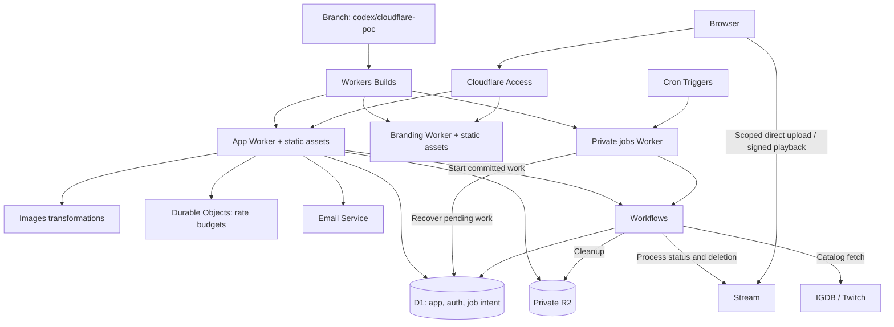

# MyTuums: Cloudflare-native migration proof of concept

Status: implementation in progress. Prepared September 10, 2026.

Current feature evidence, Railway measurements and deployment gates are summarized
in [the validation report](cloudflare-poc-report.md). The dated notes below retain
the implementation history; older outstanding-work lists are historical.

## Remote D1 initialization (2026-09-11)

Commit `9078e60` is pushed to `codex/cloudflare-poc`; GitHub CI is queued for that
branch. Full local verification passed before the final documentation and
source-map configuration checks. The connected API has now applied the seven
committed D1 migrations to `mytuums-poc` in EU/EEUR with read replication disabled.
The payload was captured from the pinned Drizzle migration runner, including its
ledger statements, and applied in one 122-statement API batch. A deliberate
failure probe first verified that the API batch rolls back table creation.

Readback confirms all seven migration hashes, zero foreign-key violations, zero
users, and exact SQL equality for all 114 schema objects against a fresh local
migration. See [the initialization record](artifacts/cloudflare-poc/d1-initialization-2026-09-11.json).
The baseline is deployed now: append future migrations and do not regenerate it.
No production data was imported, R2 was untouched, and Workers remain undeployed.

## Bounded native email delivery (2026-09-11)

Six focused regressions first failed against the single-attempt sender: temporary
errors were not retried and original provider diagnostics escaped. The native
sender now snapshots the rendered message, permits three attempts for documented
rate-limit/internal-service errors, and waits 500 ms then 1 second. Permanent,
daily-limit and unclassified failures stop immediately. Terminal errors discard
the provider's message and cause. All 21 auth unit checks and both the actual
application-artifact and native auth-email fixtures pass; scoped typechecking,
ESLint and repository Oxlint also pass. Full verification subsequently passed,
including 651 integration checks across 55 files (761.30 seconds). That run
predates the durable moderation notice changes below.

Moderation notices now commit in D1 with the action, including inverse actions,
case resolution and appeal review. Immediate delivery and jobs recovery share
one renderer and fenced claim/acknowledgement implementation. Five D1 regressions
cover the commit/send crash gap, atomic rollback, transient retry with recipient
ordering, stale sender fencing, and private-content retention/account deletion.
All 109 scoped moderation and appeal checks pass. The jobs Worker now binds
Email Service and uses the dedicated app/jobs `APPEAL_TOKEN_SECRET`; all eight local Workflow checks pass. Full verification passed: 1,521 unit/native checks and 656 integration checks
across 56 D1 files (782.74 seconds).
See [operations](operations.md) for attempt, lease and retention limits.

Better Auth can still swallow a terminal send failure; durable auth mail intent
remains outstanding. The documented Email binding has no idempotency key; no
exactly-once delivery guarantee is claimed.

## Local D1 recovery rehearsal (2026-09-11)

`pnpm --filter @my-tuums/db db:rehearse:recovery` now creates two disposable local
test databases and rehearses the actual Wrangler SQL export/import path. Both
the exploratory rehearsal and the repository command passed. After the durable
mail migration, the command passed again with 114 schema objects, 37 tables,
the seven-entry Drizzle ledger, exact synthetic row contents,
foreign-key validation and an unchanged migration rerun. Restored username,
account-deletion, favorite-count and orphan-media cleanup triggers also passed.
The command removes its own temporary resources and accepts no target or remote
option. Existing local PoC data and all remote resources remain untouched.

Scoped database typechecking, ESLint, repository Oxlint and all 27 documentation
checks pass. Automatic approval review rejected the attempted `--remote`
negative test because of possible remote data changes; that invocation was not
run. Code inspection confirms argument parsing occurs before resource creation.
The operations runbook now explains the local rehearsal, retained SQL exports
and the unverified hosted recovery boundary. D1 recovery alone does not restore
R2 objects, Stream assets, Workflow state or Durable Object counters.

Read-only plugin checks still reach Workers successfully and show no PoC Worker
deployments. Stream returns authorization error 10002; Email Sending limits and
sending-subdomain inspection return 2036. Account/service permission confirmation
is pending; those errors do not prove whether the products are enabled.

## Native HTTP verification transport (2026-09-11)

The diagnostic-privacy verification passed build, lint and typechecking, then
failed the native HTTP fixture with `write ECONNRESET` on a rejected upload.
Twenty isolated runs passed; the concurrent server suite reproduced the failure
at the same request. Switching the fixture from Miniflare's binding proxy to
`dispatchFetch` HTTP ingress passed all 193 server checks across 20 files. The
upload body, expected 401, authenticated upload assertion and production body
cancellation are unchanged. The subsequent full repository verification passed:
all builds, lint, typechecks, formatting/docs, 1,532 unit/native checks and 651
integration checks across 55 D1 files (791.07 seconds). That run preceded the
email-retry change; the new recovery command was checked separately.

## Native diagnostic privacy (2026-09-11)

After the successful full verification/browser run, a workerd regression
reproduced private provider/email data in Better Auth's default logs. A second
run exposed Better Call's independent raw-error logger even with a custom Better
Auth callback. The auth factory now emits content-free diagnostics and converts
unexpected failures to generic APIErrors; the real D1 failure remains HTTP 500.
The native regression passes with no recipients, capabilities or SQL in logs.

The existing moderation send-failure regression also reproduced recipient/error
logging. It now requires a request-ID-only event while preserving the committed
moderation action. A focused upload/cleanup regression reproduces provider/media
key exposure and protects propagation of the original upload failure. Those
native sinks now log content-free events. The rebuilt application and six selected native runtime checks pass, as do the
upload cleanup regression, all 15 moderation-effects integration checks and 15
auth template checks. Scoped ESLint/Oxlint pass. Typechecking identified the
appeal-review context's missing request-ID field; its type now carries the same
request identifier through delivery. Full verification passed after the HTTP
fixture transport correction described above.
The dependency still catches auth email send failures internally; durable mail
retry/delivery remains unfinished, along with hosted log and provider checks.

## Branch-only legacy retirement (2026-09-11)

The owner explicitly authorized removal only on `codex/cloudflare-poc`; `main`,
other branches, their worktrees and Railway production must remain unchanged.
Removed the old Node application entrypoint/Sentry adapter, Node production
bundler and Docker files, PostgreSQL test/config helpers, pg-boss video queue and
S3 video maintenance tooling. Historical PostgreSQL migration SQL is retained.
Their scripts, exports and direct dependencies were removed; D1 migration commands
now use the root `db:migrate` wrapper.

The former Node bundled-email regression is ported to the existing workerd/D1
fixture, covering all three auth email builders. Native CI now has Verify and
E2E tests, with no Postgres service, cloud bucket secrets or Docker build. Worker
artifact/Workflow checks remain part of `pnpm verify`. Main's required checks and
remote infrastructure are not changed. The native email regression, all lint
checks, frozen dependency install, workflow YAML validation and documentation
checks pass. The first full verification exposed the Node tooling config's obsolete
server-only root directory; it now uses no-emit checking with shared E2E fixtures.
Full `pnpm verify` now passes: build, all lint/typechecks, formatting, docs,
1,531 unit/native runtime checks, migration validation and all 651 integration
checks across 55 local D1 suites (818.88 seconds). The complete browser/HTTP
portfolio also passes 107/107 in 4.4 minutes. These are local synthetic-provider
checks, not evidence of hosted provider availability. All branch refs and other
tracked worktrees were checked against the pre-retirement baseline and remained
unchanged.
Interactive local development and hosted provider activation remain incomplete.

## Implementation status

This branch is in progress and is not deployable yet. It starts from main
commit `9365342`. The original Railway checkout and production are unchanged.

Implemented foundations:

- The application now has its own Worker entrypoint and generated binding types.
  Wrangler builds the actual SPA plus D1/R2/Images/Stream/Email, both SQLite rate
  counters and the jobs Worker's external video Workflow. The normal server build
  is now a native dry run, with Turbo enforcing SPA-before-Worker ordering.
  Artifact tests also wait for the branding build. Config requires the isolated
  PoC origin/account/namespace and all three OAuth pairs. Secrets and provider
  errors cannot escape failed initialization. Every response is private/no-store
  and noindex. The SPA's static/runtime metadata and crawler files use PoC hosts;
  Google/Discord/Twitch buttons match the required backend providers.
  External preview requests currently fail closed to plain links; this is a
  documented limitation pending verified connection-time destination checks.
  The artifact test passes with real D1/counters and synthetic providers,
  covering Access, assets, auth/session, email links, all three OAuth callback
  origins and preview refusal without external network requests. All four
  workspace builds pass. Worker types, scoped lint and repository Oxlint pass.
  All 651 API integration checks pass across 55 D1 files. The browser harness
  now runs real Worker services with local D1/R2, preserving migrations/platform
  metadata during reset and loading no production credentials. Its 124 E2E lint
  errors are resolved. All 17 HTTP contracts, 14 focused Worker checks and 26
  selected browser/setup checks pass, including image uploads without S3 skips.
  The native video browser test now passes upload recovery, explicit submission,
  author-only pending UI and cancellation through a synthetic Stream provider
  with actual Workflows. E2E typecheck/lint pass. Manual notification pruning
  also uses guarded D1 and the scheduler's bounded retention operation; its local
  CLI smoke passes. The first full 107-check E2E run passed 103 checks and exposed
  stale Stream CSP expectations plus a post-seeding parameter overflow; follow-up
  verification is recorded below. Full repository verification still fails on
  legacy operational/runtime callers. Live providers,
  OAuth registration/public One Tap client ID and deployed parity remain
  outstanding. No Worker has been deployed.

- The retired FFmpeg application, Dockerfile, native encoding tests and CI queue
  smoke are removed from this branch. The replacement is `apps/jobs`, whose
  compiled Workflows suite is included in the root unit/verification scripts.
  `pnpm jobs:dev` starts its local runtime separately. The original implementation,
  measurements and operations remain linked to immutable commit 9365342.
  Legacy API queue/storage exports are retained until the Node operational
  application is retired; E2E no longer imports them. PostgreSQL migration history remains intact.
  R2 was rechecked through the plugin: the PoC bucket returns HTTP 200, EU
  jurisdiction, public managed access disabled and no custom domains.
  Verification: Wrangler dry run, all seven compiled native jobs tests, jobs
  typecheck/lint and all 27 documentation files pass. The lockfile was regenerated
  with pnpm 12.1.0 and passed its supply-chain policy checks. Full `pnpm verify`
  now stops at the unported Node server build, which still imports removed
  database/auth/storage singletons; the retired workspace is no longer a build
  target. No Cloudflare deployment or Railway change was made.

- The branding deployment now has a native Worker entrypoint and Wrangler
  configuration for `about-cf-poc.mytuums.com`. Every request, including static
  assets, validates Access and the exact hostname. Public workers.dev and preview
  URLs are disabled in configuration, and assets cannot bypass the Worker or
  turn missing paths into successful documents. PoC links, canonical/structured
  metadata and crawler files use the two PoC hosts; robots and response headers
  discourage indexing. The full Vite build and Wrangler dry run pass: 21 static
  files, a 45.66 KiB Worker bundle (11.40 KiB gzip). A native test executes the
  actual built artifact, local asset router and ephemeral RSA Access validation,
  proving document/asset denial, alternate-host refusal, GET/HEAD behavior,
  missing-path 404s and PoC links. Browser/Worker typechecking and scoped
  ESLint/Oxlint pass. Full verification still stops at the legacy video-worker
  build; rebuilding branding resolves its generated-artifact documentation
  errors, leaving the legacy video smoke artifact missing. This is not yet
  deployed or connected to branch-restricted Workers Builds.

- Link-preview resource ownership is now bounded across DNS, request headers and
  response bodies. Late DNS answers cannot initiate a request; late HTTP
  responses and unread redirect/error/wrong-content-type bodies are cancelled.
  Six regression checks first reproduced these gaps and now pass alongside the
  existing 72 guard checks and all 14 link-card integration checks. Worker
  typechecking and scoped lint pass. The native network transport is still outstanding;
  this change does not replace connection-time address validation.

- The complete application router now bundles into workerd through the native
  oRPC fetch adapter. API storage depends on the small object-storage contract;
  signed S3 URLs remain confined to legacy delivery. Real multipart File inputs
  retain Worker types and runtime validation. A local native test composes real
  Better Auth, committed D1 migrations, private R2, Images and both Durable Object
  counters. It proves sign-in, RPC CSRF refusal, profile/post image uploads,
  owner-only media access, resizing, deletion and invalid-image rejection. The
  emitted bundle contains no AWS SDK, Sharp or Undici implementation.
  `apps/server/worker/application.ts` now connects this API to the Access/HTTP
  boundary, image and video delivery, database health and page metadata. The
  combined test uses real Access verification with ephemeral RSA signing keys,
  and proves host refusal, health, reserved routes and rendered login metadata.
  Email delivery, assets and preview networking remain synthetic; hosted
  services and video delivery through this composition still need validation.
  Auth receives a lazy 1 MiB-limited stream, so the existing Better Auth
  request-phase limiter runs before parsing without duplicate consumption or
  copied endpoint rules. Native instrumentation proves exactly ten sign-in
  admissions, then a 429 without pulling the rejected body's bytes; an oversized
  lengthless stream cancels at the limit and returns 413. The combined test and
  both standalone HTTP suites pass (14 checks total).
  The existing six image/publication/cleanup integration suites pass all 57
  checks. After replacing remaining UUID imports with Web Crypto and removing
  the Node address-parser dependency, the native test, all 72 link-guard unit
  checks and all 14 link-card integration checks pass. The address guard retains
  refused ranges and now explicitly rejects malformed and ambiguous address
  spellings. Node DNS/Undici transport is isolated in `link-card-node.ts`;
  the secure native preview transport still needs implementation. Scoped
  ESLint/Oxlint and Worker typechecking pass. Full `pnpm verify` still stops at
  the unported legacy video-worker build; deployment wiring remains outstanding.

- Appeal capability signing/verification now uses native Web Crypto with an
  explicit API service dependency. The secret has no import-time environment
  lookup or built-in fallback. Moderation removal/suspension/ban emails use the
  supplied deployment origin and signer; intake and previews await verification.
  Existing token format, nonce semantics and seven-day expiry are preserved.
  Both payload and signature require canonical encoding; signing refuses tokens
  beyond the verifier's 4 KiB bound. Thirteen unit checks, a real workerd test
  without Node compatibility, and all 113 appeal/moderation integration checks
  across four local D1 suites pass. Scoped ESLint/Oxlint and Worker types pass.
  The app entrypoint still needs to bind the secret; durable email delivery
  remains outstanding. Email asset origins are now explicit as described below. Full
  `pnpm verify` still fails at the legacy video-worker build, and API typechecking
  still reports unported CLI/video maintenance code. Documentation checking is
  also incomplete while generated branding/video-worker build artifacts are
  missing; local Worker context links were corrected.

- D1 factory receives a binding; no PostgreSQL pool is created at import time.
  Its type excludes interactive transactions so unported callers fail typechecking.
- All 35 auth/application tables have SQLite definitions and a separate
  `packages/db/drizzle-d1` migration history. PostgreSQL migration history remains.
- Better Auth is created per environment with explicit database, origin, secret,
  provider credentials and email transport. Schema generation uses the same
  plugin configuration and a query-refusing SQLite adapter.
- Native email sender uses a Cloudflare Email Service binding; Resend has been
  removed from the auth package. All auth/moderation templates now receive the
  deployment origin explicitly, including inverse/case/appeal-review notices and
  OTP messages. The auth package no longer reads process environment or exports
  a global origin; malformed origins reject instead of falling back to localhost.
  The real auth factory and renderer execute in a native workerd/D1 fixture:
  signup, origin refusal, mandatory email verification and sign-in pass, alongside
  safe French moderation rendering. Email delivery is captured synthetically,
  so this does not prove hosted Email Service access or delivery. React Email's
  `workerd` export condition selects its edge renderer. Fifteen template unit
  checks and all 153 auth/moderation integration checks across four local D1
  suites pass, as do auth and Worker typechecks and scoped ESLint/Oxlint.
  Full verification still fails at the legacy video-worker build; API types
  still report the unported CLI/video modules. Durable
  moderation email delivery and the live app entrypoint remain outstanding.
- The native HTTP boundary now implements Access/origin gating, trusted edge
  identity, admin endpoint denial, bounded auth/RPC bodies, session-aware media,
  page gates and explicit SPA fallback. One upload-sized RPC is admitted per
  isolate; small RPCs remain independent. Native security headers and document
  transforms preserve CSP and use the configured metadata origin. The Access verifier now validates fixed issuer/audience, RS256 signature and
  required expiry against bounded public-key retrieval. Production service and
  asset binding wiring remains outstanding. Owner-only Access applications are
  now provisioned; deployed authentication behavior remains unverified.
- API context accepts explicit services instead of creating process-wide defaults.
  Rate admission is now asynchronous; procedure middleware and appeal intake
  await it before side effects. A native SQLite Durable Object counter persists
  each policy/caller window, with opaque object names and expiry alarms. Better Auth also has an atomic Durable Object storage adapter that preserves
  its endpoint policies and inactivity windows. HTTP namespace wiring and
  deployment remain outstanding. Local pre-body auth admission now runs through
  Better Auth itself, as verified by the combined application test above.
- Video submission commits its private pending text, queued state, 30-minute
  deadline and stable Workflow intent in one D1 batch. `packages/api/src/jobs.ts` dispatches
  only after commit, checks instance status after an ambiguous create, and
  retains unconfirmed dispatch with bounded backoff. Recovery processes at most
  50 due records; intents survive owner deletion and contain only identifiers.
  The native `apps/jobs` Worker now hosts video, game-sync and maintenance Workflows and
  minute Cron recovery. Completion monitoring retires confirmed completion,
  restarts errored instances with backoff and returns unconfirmed instances to
  dispatch under their original IDs. Operator pauses/terminations are respected.
  Daily game sync and general R2 cleanup now pass local runtime tests.
- `packages/api/src/stream.ts` implements the native Stream provider boundary. Status,
  captions and deletion use the binding; resumable tus creation and recovery
  by exact creator ID use REST where the binding has no equivalent. Uploads
  require signed playback from creation, keep the 500 MB / five-minute policy,
  and send only environment-scoped opaque IDs. Upload destinations, ownership,
  response bounds and content-free errors are checked. The native upload service,
  video router, browser tus protocol and video Workflow now use it; HTTP Worker
  entrypoint construction and deployed provider verification remain outstanding.
  [Stream binding](https://developers.cloudflare.com/stream/manage-video-library/bindings/),
  [tus uploads](https://developers.cloudflare.com/stream/uploading-videos/resumable-uploads/)
- Native Stream upload ownership is committed before provider creation, with a
  database-clock 24-hour expiry. Only its author can obtain the capability.
  Completion verifies authenticated provider upload status and keeps explicit
  author submission separate. The browser resumes from a HEAD-confirmed offset
  and verifies each PATCH acknowledgement; cancellation retains the allocated ID.
- Stream cleanup survives cancellation, account deletion and ambiguous creation,
  including a provider UID that arrives after its owner disappears. Database
  triggers record debt atomically. Recovery processes ten due records, retries
  failed deletions and lists by exact creator ID for unknown/late UIDs. Empty
  records remain for 24 hours from creation with hourly checks; this conservative
  window needs remote validation and is not a provider consistency guarantee.
  Unsubmitted expiry processes at most 50 rows. Minute maintenance now invokes
  upload expiry, processing deadline recovery and Stream cleanup.
- `packages/api/src/stream-processing.ts` atomically fails processing, records
  cleanup, creates one link-free notification and erases pending text/captions.
  Deadline recovery considers at most 50 rows and rechecks the stored 30-minute
  deadline using D1's clock in each write. Retries, cancelled videos and deleted
  accounts preserve notification/cleanup invariants. The native Workflow polls
  current state, uploads captions with native streams and publishes atomically.
  Private values stay inside each step; persisted results contain control flags
  or IDs, and errors are sanitized before entering Workflow history.
- Video schema and publication are now Stream-native. The never-deployed D1
  baseline was regenerated through Drizzle Kit with all 35 tables; five custom
  migrations preserve handle/tree, favorite-count and media-cleanup invariants.
  No source/multipart/attempt/inventory/deletion flag remains on native video
  rows. Ready/published rows require a provider UID and valid dimensions/duration.
  Historical PostgreSQL migration files are unchanged.
- `packages/api/src/stream-publication.ts` records ready metadata and latches
  author eligibility, target privacy/blocks and the deadline inside the D1
  publication batch. The shared post builder commits the post, attachment and
  reply/quote notice with video state and pending-text removal. Concurrent
  delivery publishes once; refused targets fail privately with cleanup.
  Attachment byte size now describes the accepted upload, not derivative storage.
- Playback uses native Stream token generation after current post authorization,
  rechecked after provider I/O. Tokens expire in one hour, and direct Stream
  requests do not revisit Access or the app during that window. Captions are
  fetched privately with a 1 MiB bound. Two-second timeline previews use a local
  VTT index with at most 150 individually authorized Stream thumbnails. The
  player discovers quality levels from the HLS manifest instead of stored
  FFmpeg filenames. Crawler thumbnail JSON now uses D1 decoding as well.
  Worker routing/CSP and deployed playback still need validation.
  [Stream token lifetime](https://developers.cloudflare.com/stream/viewing-videos/securing-your-stream/),
  [Stream thumbnails](https://developers.cloudflare.com/stream/viewing-videos/displaying-thumbnails/)
- Local D1 contract tests use Miniflare/workerd and actual migrations.
- API integration suites now use per-file ephemeral D1/auth fixtures, with no
  production environment loading. The broader suite is not passing yet.
- Query execution and keyset/alias types target SQLite; PostgreSQL-specific
  query expressions and transaction algorithms remain to be ported.
- Immediate post publication atomically commits the post, attachments and owed
  notifications in D1. Image uploads persist their keys before storage writes;
  publication consumes that intent and checks its 30-minute expiry inside the
  same batch. Cleanup intents survive account deletion and storage failures.
  Reconciliation reads pending and published references in one SQL snapshot.
  Minute maintenance now schedules bounded expired-upload cleanup.
- Profile and link-card image uploads now register immutable paths before PUT
  and publish them through an expiry-guarded D1 batch. The new `media_intent`
  table protects pending uploads and retains cleanup debt without owner foreign
  keys. Database triggers capture superseded images and account/post cascade
  cleanup inside the corresponding transition. Post tombstoning removes image
  attachments and records cleanup in the same batch. Failed removals remain
  retryable; request paths attempt cleanup after commit, and bounded recovery
  processes at most 50 ready intents. One SQL snapshot of all image references
  after inventory listing closes the pending-to-published handoff. A concurrent
  link fetch returns the committed cache row, so purge wins over both successful
  refresh and stale fallback. Native R2 operations and scheduled cleanup are
  implemented; Worker-compatible SSRF transport still needs implementation.
- `apps/server/worker/media.ts` serves private R2 image bodies directly and
  derives allowlisted WebP sizes using the Images binding. Original and variant
  requests are authorized before I/O and rechecked before delivery. Every image
  response uses private no-store caching, including profile displays. GIFs retain
  their original bytes. Failed transformations fall back to a fresh original read;
  only a content-free event is recorded. Output bytes are bounded before R2 PUT,
  with one generation per reused resolver to limit Worker memory. The native
  runtime has no S3/presigning or Sharp import; legacy callers still use those
  dependencies until the application entrypoint is replaced.
  [Images binding](https://developers.cloudflare.com/images/optimization/binding/)
- Post/feed/attachment projections now decode SQLite JSON, booleans and timestamps
  into the existing response contract. ID sets use one JSON parameter; reply
  traversal retains its fanout, depth and output bounds without lateral joins.
- Account deletion uses an atomic descendant-set delete instead of recursive
  foreign-key cascades, which exceed D1's trigger depth on deep conversations.
  The never-deployed D1 baseline was regenerated through Drizzle Kit to include
  this parent-key change. Historical PostgreSQL migrations are untouched.
- Likes and reposts now use atomic conditional D1 batches for reactions,
  notifications and earned badges, with visibility rechecked in the batch.
  Concurrent duplicates notify once, while remove/add remains a fresh event.
  Badge upgrades retain the highest earned tier and its original timestamp.
- Relationship writes no longer require advisory locks. Public follows, private
  requests and approval evaluate privacy/block rules inside their D1 write batch,
  together with notifications and badges. Unfollow atomically deletes the edge
  and request; reject/cancel are single deletes. Blocks sever both directions.
  Profile and relationship projections decode SQLite counts, JSON badges and booleans.
- Notification reads decode SQLite JSON/booleans and retain burst damping.
  Read-cursor updates count newly read rows within one atomic D1 batch;
  concurrent retries do not double-count and future-dated rows remain unread.
  List, badge and bounded 250-row pruning share the 90-day horizon, preserving
  moderation notices and seen cursors. Scheduling and the legacy CLI still need porting.
- Post edits guard ownership and tombstones inside the same D1 batch as history
  capture and content replacement. Author deletion commits the tombstone and
  durable video cleanup together, preserving the original timestamp on retry.
  Stream cleanup is captured by the video-state trigger in that same batch;
  cleanup debt has no foreign key and survives account deletion.
- Post moderation uses D1 batches for removal/restoration, audit entries,
  notifications, report resolution and manual appeal closure. The removal email
  uses the batch's content snapshot and is sent only after commit.
- Account bans, suspensions, unbanning and role changes now use D1 batches
  with rank guards, session revocation, report/audit/notice writes and independent
  sanction/role appeal closure. Suspension responses and email use the stored
  database expiry. Case resolution commits report stamps with its audit count;
  queue reads decode SQLite JSON and timestamps.
- Appeal intake now checks eligibility and inserts in one D1 batch, with
  capability verification/budget ordering preserved. Shared stored-action SQL
  checks current state and latest-action ordering; suspension currency uses the
  database clock. Concurrent opens produce one appeal, reused nonces retain
  precedence and a final review prevents fresh-link retries.
- Appeal review composes the guarded inverse with the review stamp, resolution
  audit and notices in one D1 batch. Open status, original actor, action order,
  current state and rank checks prevent stale or conflicting reviews. Only the
  winning caller sends email. The old callback runner and target-row locks are
  removed; durable email snapshots now share the guarded commit and are recovered
  by minute maintenance.
- User, post and game search use literal Unicode substring matching in D1.
  The existing 100-character input bound, visibility and pagination are preserved.
  Handle prefixes keep an indexable range; other text uses INSTR with only the query's
  case variants converted. Long alphabets use a bound recursive JSON sequence.
  Unicode 17 simple-case data is generated from a pinned, checksummed source,
  with its license included; there is no additional service or package dependency
  or write-time index to synchronize. Accents and character count remain significant.
  Search still scans candidate text; measure deployed cost before a production move.
  [D1 limits](https://developers.cloudflare.com/d1/platform/limits/) and
  [Unicode case data](https://www.unicode.org/Public/17.0.0/ucd/CaseFolding.txt) explain
  the platform constraints and pinned matching rules.

- Game favorite/unfavorite uses an atomic D1 mutation/count-read batch.
  Migration 0002 maintains counts through database triggers, including account
  deletion cascades. Game reads decode booleans and use database-clock release
  comparisons; hashtag resolution binds its 200-key budget as one JSON value.
  Catalog upserts use five-row statements within D1's parameter limit. The
  catalog publisher now stages version rows and atomically updates the live
  projection and active-version pointer. A database-clock lease prevents stale
  or overlapping publication; complete-catalog guards preserve incumbents and
  permanent hashtag identities. Counts and creation timestamps stay on stable
  game rows. Sync and fixture seeding use this publisher; direct `upsertGames`
  remains an integration-fixture helper. Recovery removes at most 250 obsolete
  staged rows and ten empty versions per pass, protecting active/running builds.
  Covers use immutable version-specific paths, upload intents and transactional
  cleanup triggers. Their pending/live references participate in the shared
  reconciler. Native runtime adapters, Workflow integration and scheduled
  recovery remain to implement.
- Ranked feeds use SQLite window queries to choose the latest eligible repost
  per original before limiting. The existing scorer, candidate/history bounds,
  exact hashtag matching and frozen pagination are preserved. Snapshot insertion
  and bounded cleanup commit in one D1 batch; concurrent builds retain the
  ten-row viewer cap, and expiration uses the database clock. History ID sets
  bind as JSON. Ranked candidates, live hydration, suggestions and chronological
  feed filters share the Unicode text matcher.
  [SQLite window functions](https://www.sqlite.org/windowfunctions.html) and
  [D1 batch semantics](https://developers.cloudflare.com/d1/worker-api/d1-database/)
  underpin these query and transaction replacements.

Verified so far:

- `pnpm --filter @my-tuums/api exec vitest run --project integration src/d1.int.test.ts`:
  timestamp precision/defaults, atomic rollback, handle normalization/uniqueness,
  duplicate reaction idempotency/cascade deletion, cursor walks across tied timestamps,
  verification and session revocation (six tests).
- Auth unit tests: existing email rendering assertions pass.
- Game favorite lifecycle, favorites, directory and mention suites: all 29
  tests pass, including count-write rollback in both directions, concurrent
  duplicate favorites, account-cascade count maintenance and the 200-key
  hashtag boundary. Game procedure types and scoped ESLint pass. The later
  catalog port also removes sync and seeder transaction callbacks. `pnpm format` completed;
  `pnpm verify` still stops at the legacy video worker's removed `db`/`closeDb`
  imports. Native Stream/Workflows now exist; removal of legacy runtime callers
  remains outstanding.
- Database and auth package typechecks pass before the broader application port.
- D1 contracts, onboarding, post-publication, post-media authorization and post-read
  integration suites: 20 tests pass. These include atomic publication rollback,
  self-notification suppression, expiry, cleanup retry, nested JSON/boolean
  contracts, private parent/quote gates and deletion of a 120-level reply tree
  while preserving another author's quotes and unrelated posts.
- All 12 post-create cases pass, including image readback and concurrent
  reconciliation. Post/list/thread tombstone setup now uses native D1 moderation.
- All six existing like tests pass. New reaction contracts
  prove notification idempotency,
  whole-batch rollback on badge failure, a real 10,001-like threshold crossing,
  and retention of earned tiers across retries, recedes and concurrent upgrades.
- Follow/lifecycle suites: all 15 tests pass, including concurrent retries,
  approval versus withdrawal, and preservation of requests/notices on rollback.
  Block/unblock/listBlocked: all six selected tests pass, including concurrent
  follow/block for both public and private targets. The obsolete advisory-lock
  hash tests were removed; the database concurrency invariant remains tested.
- Notification integration: all 28 existing tests pass. Three new D1 contracts
  pass for concurrent read stamps, undamped actionable/system notices, and
  restartable pruning that preserves moderation history and seen cursors.
  Notification production modules and the new contract tests have no type errors.
  Lint on the existing notification suite still reports unsafe types propagated
  from unported post procedures; these were not suppressed.
- Privacy, post and repost integration suites pass after the search/feed port,
  including private notification redaction and searches following edits.
  PostgreSQL lock-observation tests now assert real concurrent D1 outcomes.
  Two new mutation contracts pass: history rollback and concurrent identical
  edits, plus atomic video deletion and cleanup debt that survives owner deletion.
  New mutation modules pass scoped ESLint and introduce no API type errors;
  the broader API typecheck remains red.
- Before the appeal port, focused post moderation/effect checks passed 18 of 20 cases, including rollback
  after audit/report/notification writes, concurrent restore and deletion/removal
  races, and manual appeal reversal/withdrawal. The remaining two failed during
  appeal intake setup; the later appeal checks below supersede that result. The shared notification writer's ten reaction,
  follow and inbox contracts pass with database-resolved recipients.
- All 14 existing moderation-effect tests pass. Three new account/case contracts
  pass for ban rollback preserving sessions and reports, independent appeal
  families, and case-resolution rollback/concurrency. Before the appeal port, the broader queue/case/account
  selection passed 34 of 41 tests: four cases failed in appeal intake
  setup, two in user search and one in a search fixture exceeding D1's parameter limit.
  The account module, queue module and affected effect/contract tests passed ESLint.
  The previously failing shared transaction runner has since been removed.
  Broader API typechecking remains incomplete; no rule was suppressed.

- Appeal intake's five real-D1 contracts pass, including tied action timestamps,
  unrelated targets, concurrent duplicate links and nonce precedence across rows.
  After the review port, all 25 selected existing appeal-flow and deletion checks
  pass, including the intake-versus-manual-restore race, both capability budgets,
  role restoration and superseded-action refusals. The two previously failing
  review cases are included in that passing selection.
  Intake and shared action-state SQL have no API type errors; broader API
  typechecking still reports unported transaction and PostgreSQL callers.
- The five moderation/intake/review contract suites pass all 26 tests. New review
  cases prove late review-stamp failure rolls back the restoration, audit and
  notices, and conflicting reviewers commit exactly one decision with matching
  state, audit timestamp and email count.
- A full moderation/preview/notification sweep passed 118 of 122 tests before
  replacing the PostgreSQL query-plan test. Three failures are in unported user
  search (including its oversized fixture); preview and notification suites pass.
  The replacement real-D1 EXPLAIN test caught a latest-action probe scanning all
  actions of one target type. Null-safe equality on both target keys now uses
  the full target index. That test and both appeal contract suites pass (eight
  tests); the obsolete PostgreSQL capture/interpolation helpers were removed.
  All 25 selected appeal-flow/deletion cases also pass after that predicate change.
  The new production modules and contract tests have no API type errors or scoped
  ESLint findings. Linting the older `moderation.int.test.ts` still finds two unsafe
  uses of `post.create`'s result, whose type flows through the unported video branch.

- Search's 45 checks pass for literal punctuation, Unicode, visibility, keysets
  and game suggestions. The complete moderation suite now passes all 87 tests,
  including its three formerly failing search cases. Its Unicode caller contracts cover full-length
  queries and edited content; their long-alphabet path stays within
  D1's SQL limits without reducing the application's query-length limit.
  Regeneration plus formatting reproduces the identical Unicode artifact. The
  new search modules, generator and tests have no API type errors; broader
  API typechecking remains incomplete in unported modules.
  Linting the search modules, tests and generator finds no errors. The later
  game port removed the favorite transaction callbacks and their lint errors.

- Feed regression verification covers 145 passing integration checks across
  ranked feeds, Discover filters, posts, reposts, privacy and the new D1
  lifecycle contracts (the full run plus a targeted rerun of corrected test
  expectations). Seventeen scorer/tokenizer unit tests also pass. New contracts
  cover late cleanup failure rolling back insertion and the global sweep,
  the 100-row sweep bound, protection of the fresh snapshot, 16 concurrent
  builds respecting the ten-row cap, full 200-row history, and Unicode matching
  through ranked/chronological reads and edited-content resumption. Ranked
  modules and their tests pass ESLint and introduce no API type errors. The
  broader API typecheck and two `posts.ts` lint errors still reach the unported
  video submission path; these have not been suppressed.

- Media verification: all eight new D1 lifecycle contracts and 62 post tests
  pass together. The image/profile/link, post-mutation and post-read regression
  suites also pass; the only failure in their earlier combined run was an
  oversized compound SELECT in the new reference reader, corrected and verified
  in the final 70-test run. Six reconciliation unit tests pass. Contracts cover
  cleanup-write rollback, expiry during PUT, retry after storage failure,
  account cascade, atomic post tombstone cleanup, upload-time reconciliation,
  concurrent purge and an ambiguous image PUT. Media production modules and
  new tests have no type errors or scoped ESLint findings. The broader lint
  invocation still reports the legacy reconciliation CLI's removed global DB
  imports and post tests whose result type reaches the unported video branch.

- Catalog verification: all 16 existing synchronization tests pass with staged
  publication and immutable cover keys. Seven D1 catalog contracts pass in a
  targeted final run: invisible/retryable staging, complete-catalog guards,
  late pointer-write rollback, stable favorites, exclusive leases, stale-run
  fencing, cover expiry/protection, and bounded cleanup including abandoned
  leases. The eight media-intent contracts also pass after including game covers
  in the reference reader. Thirty-nine image, reconciliation and fixture unit
  tests pass. Scoped catalog lint and migration metadata checks pass; catalog
  modules introduce no API type errors. The native fixture adapter, Workflow
  integration and scheduled recovery are still pending.

- Workflow dispatch verification: five real-D1 contracts pass for concurrent
  submission, rollback when intent insertion fails, recovery after account
  deletion, ambiguous instance creation, backoff and the 50-job bound. The
  Stream adapter's ten unit cases pass with synthetic transport/binding doubles;
  they cover tus privacy/limits, creator isolation, idempotent deletion, bounded
  responses, safe upload destinations and content-free errors. Native Stream
  account behavior remains to verify after deployment access is available.
  New modules and the updated upload service pass scoped lint and introduce no
  API type errors. The remaining legacy video algorithms/tests and server setup
  still expect PostgreSQL queues and require replacement; full verification is
  not passing yet.

- Native upload and failure-recovery verification: all 17 tests across the
  Stream upload, processing, Workflow-intent and post-mutation D1 suites pass.
  They cover ownership, explicit confirmation, cancellation rollback, late/unknown
  provider creation, account deletion, processing deadline bounds, duplicate
  failure notices and rollback when notification/cleanup insertion fails.
  The obsolete S3 multipart upload suite is replaced by native contracts,
  including recovery after provider completion and an interrupted API request.
  All three browser tus protocol tests and all ten Stream adapter unit tests
  pass, including a lost PATCH response and cancellation during allocation.
  Scoped ESLint and strict Oxlint pass without suppressions; provider JSON is
  parsed at the I/O boundary and browser tests use the existing client seam.
  The frontend builds independently with the native upload contract; the full
  build is still blocked by the old video worker. The subsequent native
  publication/playback port removes that legacy queue import from the API root.
  Provider interactions are synthetic;
  deployed Stream behavior and the final Worker wiring are not yet verified.

- Native publication baseline verification: all 45 tests across the nine affected
  real-D1 suites pass together, covering schema invariants, upload/failure,
  Workflow intents, ordinary post effects, tombstones, native publication,
  projections and media authorization. Twelve Stream adapter unit tests and
  three existing player interaction tests also pass. Frontend build/typecheck,
  database typecheck, scoped ESLint and strict Oxlint pass. Drizzle generation
  reports no schema drift; migration metadata checks pass. API type errors are
  confined to the old queue/maintenance/worker exports and three administrative
  scripts. Provider responses remain synthetic; the subsequent jobs-runtime
  verification below covers local Workflows. HTTP routing and remote behavior
  are not verified.

- Native jobs runtime: `apps/jobs` bundles through Wrangler's deployment dry run
  and its Worker/test typechecks pass. Four tests execute the compiled Worker
  in Miniflare/workerd with migrated D1: native caption-stream publication,
  251-row notification pruning with moderation retention, absence of HTTP
  access, and the actual scheduled handler's dispatch/deadline/pruning/completion
  path. The source contains no S3, FFmpeg, Sharp or PostgreSQL runtime import.
  Cron runs each minute and schedules pruning on Monday at 04:00 UTC. Each
  pruning instance is bounded to 100 batches of 250 with durable continuation.
  The local Stream provider is a protocol fixture; real account behavior remains
  unverified. Nineteen D1 job/dispatch/monitor tests and twelve Stream adapter
  unit tests pass after the final recovery changes. The broader 34-test
  processing/publication run also passed before the additional missing-history
  recovery case. Scoped ESLint and strict Oxlint pass, including the new Worker
  and its tests. See [jobs context](../apps/jobs/CONTEXT.md).

- Native R2 and scheduled catalogs: seven compiled Worker tests now pass in
  Miniflare/workerd, including the daily 5,000-game catalog plus 100 upcoming
  games, one private R2 cover, replay freshness, cleanup/inventory retention,
  and listing/deleting 1,001 objects. Thirty-two D1 catalog/sync/media tests pass.
  This validates orchestration and catalog size, not cold-download performance
  for thousands of covers. The Worker bundle is about 876 KiB (150 KiB gzip).
  Its configuration requests a five-minute CPU limit and 50,000 subrequests;
  confirm paid account support and measure actual consumption before deployment.
  Native fetch testing exposed unsupported `redirect: "error"`; IGDB and Stream
  now use manual redirects and reject non-success responses. Provider fixtures
  remain synthetic and no remote resource was created.

- Distributed rate admission: four local workerd tests pass for concurrent
  clients, independent keys/policies, expiry, failed storage and persistence
  across runtime restart. Seventeen memory-policy unit tests and sixteen D1
  procedure/client-IP/appeal tests pass. The subsequent eight-test procedure run
  includes an additional regression proving that an admission outage creates
  no post. Native Worker typechecking passes. These tests do not establish
  deployed routing or distributed Better Auth enforcement.

- Native HTTP boundary: twenty-one tests pass across routing, bounded bodies,
  document headers and deployment-specific public metadata. One test bundles
  the actual handler into workerd and checks native request streams and headers.
  Worker typechecking, scoped ESLint and strict Oxlint pass. Auth, Access, asset
  and RPC services in these HTTP tests are synthetic; this is not evidence of
  a deployed application or full-stack feature parity. Static assets must run
  the Worker first and leave SPA fallback to this handler.

- Access and auth counters: four verifier tests and the HTTP workerd test pass
  with real RSA signatures and synthetic public keys. Wrong claims/signatures,
  missing expiry, malformed/redirected/oversized key responses and invalid
  deployment configuration are rejected. Three native auth-counter tests pass,
  including concurrency, inactivity windows and the real Better Auth ten-attempt
  sign-in rule across a counter restart. Auth and Worker typechecks pass. JOSE
  6.2.5, already resolved by the repository, is now a direct server dependency.
  End-to-end Access enforcement and deployed binding behavior remain unverified.

- Native image delivery: the compiled resolver passes a workerd test using local
  R2 and the actual Miniflare Images binding. It covers byte delivery, resizing,
  no enlargement, persistent variants, GIF preservation, provider failure fallback,
  HEAD, MIME restrictions and authorization revocation after I/O. Domain admission
  decisions are synthetic; existing D1 authorization suites cover their rules.
  Miniflare's image emulation uses Sharp locally. Hosted image processing, metadata
  stripping and orientation fidelity still require remote verification; neither
  local output nor a plugin's installed status proves deployed behavior.

`pnpm format` has run. All four workspace builds now pass with the native app
replacing the Node server build. Full `pnpm verify` reaches E2E lint and stops
on 124 unresolved legacy-caller errors. Repository Oxlint, application Worker
scoped lint/types and the compiled artifact test pass. The latest six D1 suites
pass 146 checks. A subsequent scoped run passes all seven badge checks and
one new concurrent-bootstrap check after porting fixture SQL and the admin
functions to D1. The affected feed/media/notification/moderation/repost read
checks pass. Native jobs retain their seven passing
runtime tests. Port the remaining Node/API/E2E callers and fixture setup;
do not restore PostgreSQL or suppress checks to satisfy legacy assumptions.

Next required work (none is optional for full completion):

1. Port API SQL and transaction algorithms, CLI helpers and remaining auth callers.
   Post publication, its image upload handoff, feed reads, ranking, search and
   game favorites and profile/link-card image transactions are implemented.
   Game catalog and native video publication are implemented as atomic D1
   transitions. Replace the remaining legacy queue/worker and administrative
   callers without weakening the implemented concurrency guarantees.
2. Activate the native Worker entrypoint with isolated secrets and hosted
   bindings. Its local artifact already connects Access, auth/API/media, static
   assets, page metadata and rate counters. Configure OAuth callbacks and the
   matching public One Tap client ID. Port the secure preview transport and
   validate hosted video/email/media behavior; plain-link fallback remains an
   explicit current limitation.
3. Verify hosted Images format, orientation and metadata behavior. Native
   Images/R2 routing is wired into the application. Native R2 object operations and
   Stream processing/caption handoff are implemented in the native jobs Worker.
4. Validate remote catalog performance and scheduled recovery. Native video,
   game-sync and maintenance Workflows, general R2 cleanup, pruning and
   completion monitoring are implemented and covered by local runtime checks.
5. Configure isolated resources, Access, branch builds, integrations and native observability.
6. Finish full verification, deployed feature parity, usage measurements and recovery docs.

### Preview networking investigation — September 11, 2026

The ordinary Node transport cannot simply move into the Worker. Cloudflare's
`node:https` client wraps global fetch, and its Agent is a stub; Node connection
lookup hooks therefore do not establish the existing SSRF invariant there.
[Workers HTTPS compatibility](https://developers.cloudflare.com/workers/runtime-apis/nodejs/https/)

Raw sockets can pin the validated address, but Cloudflare explicitly blocks
connections to Cloudflare IP ranges. There is also an open upstream report that
`startTls({ expectedServerHostname })` works locally but fails to apply the TLS
hostname on the deployed edge. Treat that report as a required hosted check,
not as proof that local TLS tests establish production behavior. Do not disable
certificate validation or fall back to unchecked fetch.
[TCP limitations](https://developers.cloudflare.com/workers/runtime-apis/tcp-sockets/),
[upstream TLS report](https://github.com/cloudflare/workerd/issues/6903)

Gateway egress through a VPC Network binding is a possible native alternative:
Cloudflare documents DNS, HTTP and network policy enforcement for public traffic
via `cf1:network`. That binding also reaches account-private routes, so policy
isolation and connection-destination refusal must be proven before connecting
user-supplied preview URLs. Read-only API inspection found two existing Gateway
rules, including a disabled default private-traffic block. Those rules were not
changed. The API exposes an alpha Gateway identity field on VPC bindings, but
its usable Worker identity and policy semantics have not yet been verified.
Next evidence needed: a PoC-specific policy identity, the full existing forbidden
address ranges enforced at the actual destination, no effect on unrelated
traffic, and hosted public/redirect/rebinding tests. Account-wide policy edits
or unrestricted VPC access are not an implemented substitute.
[Gateway egress](https://developers.cloudflare.com/changelog/post/2026-06-05-gateway-egress/),
[VPC routing scope](https://developers.cloudflare.com/workers-vpc/configuration/vpc-networks/),
[binding API](https://developers.cloudflare.com/api/resources/workers/)

### Remote resource inventory — September 11, 2026

The Cloudflare plugin now exposes authenticated API access. A read-only zone
lookup confirmed `mytuums.com` is active under `Ops@mytuums.fr's Account`.
Account ID: `734f3b84571b1967e6940140a0b7d75f`.
Zone ID: `e596b15a6c397986f91c737c156b7100`.
Access issuer: `https://mytuums.cloudflareaccess.com`.

| Resource                    | Identifier                             | Verified state                                                            |
| --------------------------- | -------------------------------------- | ------------------------------------------------------------------------- |
| App Access application      | `e188692f-23a1-4c09-b054-9ffea37c5699` | Protects `cf-poc.mytuums.com`; only `gab.debure@gmail.com` allowed        |
| Branding Access application | `29c44e7b-a52f-4d81-b3b9-fd1cc649b760` | Protects `about-cf-poc.mytuums.com`; only the same owner allowed          |
| D1 `mytuums-poc`            | `f4334c85-cca9-4437-976e-b52038047c62` | Seven migrations applied; no users; EU/EEUR; read replication disabled    |
| R2 `mytuums-poc-media`      | `95311368c80c4bbdb105dbc817ed6c63`     | EU jurisdiction; EEUR; Standard class; r2.dev disabled; no custom domains |

Both Access applications were created with their restrictive inline policies in
the same request and then read back. Sessions last one hour, binding cookies and
HttpOnly are enabled, and OPTIONS requests do not bypass Access. Existing Access
applications were not modified. Wire each Worker's corresponding audience:

- App: `922c01438550e418bc92d4cbdfb4f43ace516d8e348bb45a390d5256fa933124`
- Branding: `7e8b9194813d7f984e385e9be12fbc34dbfd9b2244689c9b7fd19305fbb6026e`

No Workers, Workflow instances, Builds connections, custom domains or DNS records
have been created by this implementation. D1 migrations are now applied as
recorded above; no production data has been imported. The jobs configuration records the real account
and D1 IDs; local tests remain ephemeral and independent.

R2 initially returned activation error 10042. The owner enabled it in the dashboard;
a subsequent API read succeeded. The bucket was then created and its jurisdiction,
disabled public endpoint and empty custom-domain list were read back. R2 API
operations must carry `cf-r2-jurisdiction: eu`; a location hint is insufficient.
The plugin's request helper omits custom headers. Its authenticated, API-host-only
outbound fetch supports them, as verified with a read-only EU inventory request
before creation. No API credentials were extracted or exposed.

Stream storage usage returned authorization error 10002; Images stats returned
5403 (account invalid or not authorized for the service). The Images stats endpoint
concerns hosted storage and does not establish transformation availability. This
PoC stores images in R2; Images Free includes 5,000 unique monthly transformations,
so hosted image storage is not a provisioning prerequisite. Verify the deployed
Images binding before deciding whether transformation capacity needs upgrading.
[Images pricing](https://developers.cloudflare.com/images/pricing/)

Email Sending limits returned unauthorized error 2036; subscription inspection
returned authentication error 10000. Workers account settings were readable and
reported the standard usage model, which alone does not prove the billing plan.
These errors do not establish subscription status or full API permission coverage.
Stream/dashboard permission checks remain pending. Email Sending requires Workers
Paid and remains a remote availability check before live mail tests. No email has
been sent and no subscription has been changed by this implementation.

The jobs Worker deployment dry run, generated binding types and scoped Worker/test
typechecks pass with the recorded account and database configuration. This is
build-time verification. The D1 schema is now initialized, while seeding and
Worker activation remain outstanding.

Tooling notes:

- Wrangler 4.130.0 ships Miniflare 5.20260908.0-alpha. Its constructor uses
  `workers[].config` with a module manifest and binding descriptors; v4 examples
  do not match this installed version.
- New peer-dependent packages may initially get a broken pnpm 12 link. A scoped
  `pnpm --filter <package> update <dependency>@<same-version> --no-save` repaired
  the Drizzle resolution without changing its version.
- The Better Auth CLI requires the existing tsx loader to resolve `.js` imports
  that refer to `.tsx` email-template sources; `db:generate:auth` includes it.
- Drizzle Kit misgenerates SQLite coalesce expression indexes by splitting the
  inner comma. The custom invariant migration owns these two catalog indexes.
  Future table-rebuild migrations must also preserve these indexes and the
  username normalization triggers; the D1 tests must exercise the final sequence.

## Outcome and scope

Deliver a usable, isolated Cloudflare deployment with the complete current feature set, a feature-parity report, measured costs, and an adopt/revise/stop recommendation. Production remains on Railway. This plan does not include production data import, traffic cutover, merging into main, or cancelling existing subscriptions.

Use branch `codex/cloudflare-poc`, app hostname `cf-poc.mytuums.com`, and branding hostname `about-cf-poc.mytuums.com`. Confirm resource availability before provisioning. Deploy only that branch through Workers Builds. Use synthetic data and independent secrets, databases, storage and OAuth callback configuration. Use EU-jurisdiction D1/R2; global Workers, Workflows and Stream processing are permitted for the synthetic-data PoC. This is not an EU-only processing guarantee or a change to production locality requirements.

## Service mapping and orchestration

| Current responsibility           | Target                             | Purpose                                                                            |
| -------------------------------- | ---------------------------------- | ---------------------------------------------------------------------------------- |
| Web server and React/Vite assets | Workers Static Assets + app Worker | Serve the existing frontend and preserve HTTP routing/security behavior            |
| Backend and authentication       | App Worker                         | Run oRPC, Better Auth and application authorization                                |
| PostgreSQL                       | D1 + Drizzle SQLite schema         | Store relational application data, auth, job intent and cleanup obligations        |
| Video worker / FFmpeg            | Stream + video Workflow            | Stream encodes and delivers; the Workflow manages processing state and publication |
| Game Sync worker                 | Cron Trigger + game-sync Workflow  | Fetch and stage the catalog, then publish one complete version                     |
| Prune Notification worker        | Cron Trigger + bounded job         | Apply the existing retention policy in resumable batches                           |
| Media storage                    | Private R2; Stream for videos      | R2 holds images/files; Stream owns video storage and playback                      |
| Sharp image processing           | Images binding + Worker validation | Decode/transform supported images with tested upload and privacy rules             |
| Resend                           | Cloudflare Email Service           | Send existing transactional email templates                                        |
| Process-local rate limiting      | Durable Objects                    | Coordinate rate budgets across Worker instances                                    |
| Runtime monitoring               | Workers logs, metrics and traces   | Observe errors, jobs, latency and consumption                                      |

Workers run request or event handlers. Workflows run durable sequences that can retry and wait. Cron Triggers start scheduled work. Bindings give code access to configured resources without exposing those resources as public application endpoints. No Queues service is needed initially.

D1 is managed SQLite, not PostgreSQL with a different connection string. It meets the one-provider objective, but its suitability must be established with this app's queries and concurrency requirements. Hyperdrive connects to a separately hosted database; it does not provide native hosted PostgreSQL. D1 currently has a 10 GB paid per-database limit and a single-threaded execution model per database instance. Read replication does not remove the write bottleneck. Start with one primary database and replication disabled. [D1 limits](https://developers.cloudflare.com/d1/platform/limits/)

## Implementation sequence

### 1. Record the baseline and establish isolation

- Inspect fresh main, owning contexts, current tests and deployment configuration. Inventory all features, scheduled jobs, integration dependencies, database size and representative usage where account access permits.
- Use three deployments: `mytuums-poc-app`, `mytuums-poc-branding`, `mytuums-poc-jobs`. Jobs has no public HTTP endpoint.
- Configure branch-specific builds, Wrangler bindings and dedicated secrets. Use separate resources for deployed PoC versus destructive integration/E2E tests.
- Configure Access before exposing content: owner only initially; additional testers require explicit inclusion. Disable or protect workers.dev and preview URLs.
- Preserve application authentication underneath Access. Isolate cookies, canonical URLs, OAuth callbacks, email links and passkey relying-party configuration from production.
- Check Email Sending, Stream and Images account availability and billing before dependent remote tests. Email Sending is currently beta on Workers Paid.

Exit: the intended branch serves an Access-protected shell at both hostnames; unauthorized users cannot bypass it via alternative URLs. [Branch builds](https://developers.cloudflare.com/workers/ci-cd/builds/build-branches/), [Email Service](https://developers.cloudflare.com/email-service/)

### 2. Port database correctness and auth

Owners: `packages/db`, `packages/auth`, `packages/api`.

- Convert the Drizzle schema to SQLite/D1. Generate a separate D1 migration history; preserve PostgreSQL history. Regenerate auth schema through its existing generator workflow.
- Explicitly map UUIDs, arrays, JSONB, booleans, timestamps, indexes and case-insensitive comparisons. Preserve millisecond timestamps, deterministic feed cursors, uniqueness, foreign keys and audit retention.
- Inventory every interactive transaction, row/advisory lock and savepoint. Replace each algorithm with constraints, guarded statements and atomic batches where appropriate. Never emulate transactions by sequential writes with no rollback.
- Prove moderation/audit atomicity, simultaneous reactions, follow/block races, account deletion and media lifecycle behavior. Use durable intent records for cross-service effects; D1 and external services do not share a transaction.
- Build auth and database dependencies from Worker bindings, avoiding global request-specific state. Validate the pinned Better Auth version in the actual runtime, including hashing, session revocation, OAuth, verification/recovery email, two-factor and passkeys.

Exit: schema migrations and core social/auth tests pass against actual D1-compatible runtime storage. D1 batch failure rolls back the batch; it is not equivalent to an interactive PostgreSQL transaction callback. [D1 batch semantics](https://developers.cloudflare.com/d1/worker-api/d1-database/)

### 3. Port the app server and native integrations

Owners: `apps/server`, `packages/api`, `packages/auth`; frontend changes only where runtime/media behavior requires them.

- Replace the Node server entrypoint with a Web Request/Response handler and the appropriate oRPC adapter. Preserve `/rpc`, `/api/auth`, `/media`, SPA routing, missing-asset 404s, security headers and database-backed health.
- Preserve early authentication/body-size gates, admin-auth endpoint denial and authoritative authorization checks. Prevent static asset routing from bypassing required page gates.
- Make rate-limit consumption asynchronous and enforce distributed budgets through Durable Objects. Preserve auth-specific enforcement too.
- Port link fetching without weakening SSRF protection. Refuse a preview and show a plain link when the runtime cannot securely fetch a target.
- Replace the Resend transport with Email Service while keeping templates. Verify signup, recovery and moderation mail with test recipients; expose failures and use bounded retries where appropriate.
- Add content-free structured logs, request/job identifiers and source maps. Never log email tokens, signed URLs or user content.

Exit: core features work through the deployed app/API with authorization and error behavior preserved.

### 4. Port media and durable background work

- R2 remains private. App authorization precedes file delivery or issuing a short-lived capability. Replace Sharp with tested Images-based transformations; verify accepted formats, size limits, animation behavior and metadata handling.
- Use direct resumable Stream upload capabilities. Record upload ownership and processing state in D1. Stream performs encoding; a Workflow polls authenticated processing status, enforces the 30-minute processing deadline and records failures.
- Preserve explicit author confirmation before publication. Replace FFmpeg-specific rendition, validation and source-deletion assumptions with documented Stream semantics. Expire abandoned uploads after 24 hours.
- Require signed Stream playback. Access protects the app and token issuance; direct Stream capabilities remain usable by their holder until expiry. Document and test that distinction rather than describing direct playback as Access-gated.
- Record cleanup obligations durably in D1 before removing owning rows. Cleanup must survive post/account deletion, cancellation and interrupted jobs; retries must be idempotent.
- Commit business changes and pending job intent together. Attempt immediate Workflow start after commit. Run a recovery dispatcher every minute with stable job IDs so a crash between commit and dispatch cannot lose work.
- Run games sync daily at 00:00 UTC. Stage a catalog version, preserve stable game IDs/favorites, switch the active version atomically after validation, and prevent overlapping runs from publishing stale data.
- Run notification pruning Mondays at 04:00 UTC in bounded resumable batches. Preserve the existing 90-day policy, moderation records and seen cursors.

Exit: upload, publish, playback, cancellation, deletion, retries, scheduled sync and pruning work after deliberate interruptions and duplicate starts. [Workflows](https://developers.cloudflare.com/workflows/), [Stream signed playback](https://developers.cloudflare.com/stream/viewing-videos/securing-your-stream/)

### 5. Verify, measure and hand over

- Port affected integration tests to D1 and Worker bindings. Keep strict checks and caller-visible assertions; do not substitute PostgreSQL-only tests or mocked transaction behavior as migration evidence.
- Run scoped tests, `pnpm format`, `pnpm verify`, and representative E2E journeys against the Access-protected deployment. Use a scoped Access service token for automation.
- Exercise complete feature parity: onboarding/auth, feeds, profiles, posts/replies, relationships, reactions/bookmarks, search, notifications, moderation/appeals, games, images and video. Reconcile with the baseline inventory.
- Test authorization changes during media processing, expired signed URLs, database failures, interrupted catalog sync and cleanup after account deletion.
- Measure latency, CPU, D1 rows read/written and growth, image transformations, R2 operations, Stream minutes, email volume, Workflow and Durable Object usage. Include scheduled jobs and builds, even with no visitors.
- Rehearse fresh setup and backup/restore on disposable PoC resources. Document deployment, recovery, seed/reset and exact teardown commands. Keep the review deployment available.

Exit: working deployment links, reproducible setup, passing checks, feature evidence, measured cost estimate, and a recommendation. Any unresolved feature or security/correctness invariant remains an explicit blocker to calling the complete PoC done.

## Complexity and cost

This is a substantial backend migration. The frontend hosting move is small; D1 transaction redesign and the video lifecycle dominate the work. Planning estimate for one developer: roughly 1–2 focused weeks for a useful D1/auth/core-app slice, and several weeks for the complete validated PoC. Re-estimate after the database concurrency milestone; these are estimates, not delivery guarantees.

Workers Paid starts at $5/month. Stream storage is purchased in $5/month blocks of 1,000 stored minutes, with delivery at $1 per 1,000 delivered minutes. Thus a small experiment using one Stream storage block and 1,000 delivered minutes has an illustrative $11/month Workers-plus-Stream subtotal, before any other billable usage, taxes or existing plan costs. R2 Standard includes 10 GB-month and monthly operation allowances. [Workers pricing](https://developers.cloudflare.com/workers/platform/pricing/), [Stream pricing](https://developers.cloudflare.com/stream/pricing/), [R2 pricing](https://developers.cloudflare.com/r2/pricing/)

This is not a measured estimate of the current application. The PoC must establish the other services' actual consumption and any account-shared allowance usage. Record alerts and runtime limits with their scope; a billing alert is not a universal spend cap. Cloudflare still has operational limits: D1 can overload, and Stream stops new uploads when purchased storage is full. The experiment tests lower operating effort and acceptable scalability; it does not assume unlimited scaling.

## Follow-up production decision

Only after evaluating the PoC, draft a separate production migration issue covering production locality, PostgreSQL export/transformation/import, media transfer and Stream ingestion, row/object reconciliation, auth/session implications, write freeze or synchronization, backup/restore, routing cutover, rollback and decommissioning. Do not perform those operations as part of this experiment.

### D1 administration follow-up — 2026-09-11

Founder grants and bootstrap promotion now accept explicit D1 databases. Their
lookup and guarded write share a batch: competing calls cannot exceed three
Founder holders or appoint multiple initial admins. Both commands default to
local Wrangler state, support an explicit `--remote` switch, validate the exact
PoC account/database from the application config, and use a temporary D1-only
config without application secrets or `.env`. Expected operator refusals are
shown; raw SQL/provider failures are hidden. Old Node admin/migration entrypoints
were removed; the remaining Node image and E2E harness still need migration.

The D1 migration CLI uses the same guarded connection and committed Drizzle
migration ledger. Its first local application and rerun succeed. Do not mix it
with Wrangler's separate migration ledger. `db:test:setup` now verifies the
committed migrations in disposable local D1, with no PostgreSQL connection or
shared-state cleanup. Remote D1 remains unmigrated; no remote admin mutations
were performed.

The badge/bootstrap suites pass all eight checks. Scoped ESLint, Oxlint and DB
typecheck pass. The local binding health query and migration/test preflight pass.
The actual local CLI smoke also passes: grant, promotion, duplicate/late refusal
and malformed-argument handling. It removed its exact synthetic user afterward.
A migration rerun leaves six ledger entries. Full `pnpm verify` was rerun:
all workspace builds and repository Oxlint pass; E2E lint still stops the run
with the same 124 legacy database-caller errors. Checks after that stage were
not reached. The D1 admin changes do not make the full migration complete.

### Native E2E runtime follow-up — 2026-09-11

The complete API integration run passes **651 tests across 55 D1 files**
(`/tmp/mytuums-d1-all-integration.log`, 836 seconds). This is local domain/data
verification, not hosted provider or browser evidence.

The browser harness now uses the real Worker application composition with local
D1/R2/Images and Durable Object API counters. Separate fixture processes share
D1/R2 through Miniflare's local registry owner, verified by a two-process probe.
The server applies migrations before readiness; global setup preserves the
migration ledger and protected platform metadata, resets application rows and
seeds game covers to R2. Test scripts load no `.env` or external storage credentials.
Images no longer skip for missing S3 credentials. The old video browser fixture
and its PostgreSQL/FFmpeg imports still need replacement; the current E2E Worker
has no video service and does not prove that journey.

The first HTTP run exposed missing native CORS, structured RPC size errors and
compression Vary handling. Those contracts are restored. The 404 header check
now targets a missing asset rather than following an unknown SPA page's login
redirect. All **17 HTTP checks** and **14 focused native Worker checks** pass.
The real R2 adapter accepts only the native operations it consumes, avoiding an
unsafe whole-bucket cast between Worker and Miniflare header types.
The selected browser run passes **26 checks**, including fixture signup/signin,
authentication, posting, image metadata stripping, avatar/banner editing,
password changes and theme persistence. The full E2E workspace now passes
ESLint. E2E typechecking still reaches legacy video queue/maintenance imports
that must be removed by the native video browser port. Full `pnpm verify` was
rerun: all four builds, repository Oxlint and E2E lint pass; it now stops at
18 legacy Node server lint errors. Worker typechecking passes. Checks after
that lint stage are not yet reached; no full-verification pass is claimed.

### Native video browser follow-up — 2026-09-11

The former S3 multipart browser test now runs unconditionally against synthetic
Stream tus transport. The E2E server bundles the actual jobs Worker and binds its
Video Workflow alongside the real application Stream adapter, D1 and local R2.
The provider fixture stores upload metadata only, never source bytes, and all
requests to its synthetic upload hostname are intercepted locally. It deliberately
remains in processing state; this does not verify hosted codecs or playback.

The test accepts the first 8 MiB, loses its acknowledgement, then proves the
composer resumes at the confirmed offset without resending that chunk. Explicit
submission, durable author-only pending UI after reload, and cancellation pass.
The focused browser run passes all three checks, including two account setups
(`/tmp/mytuums-native-video-browser2.log`). E2E workspace typecheck and lint now
pass with no legacy queue imports. Changed server fixture lint also passes.
The legacy Node operational runtime and full repository verification remain
outstanding; no Worker has been deployed by this follow-up.

### Native notification maintenance follow-up — 2026-09-11

`prune:notifications` now opens the guarded PoC D1 binding and shares both its
retention predicate and 250-row deletion operation with the jobs Worker. The
command loads no `.env`, defaults to local storage and dry-run reporting,
requires the current retention value, and makes deletion (`--apply`) and remote
PoC access (`--remote`) explicit. Unknown options and mismatched retention values
fail before connecting. Provider/SQL diagnostics are not printed.

The actual local CLI smoke passes reporting without deletion, explicit apply,
retention filtering and malformed-argument refusal. Its synthetic users were
removed afterward. Scoped CLI lint, DB typecheck, repository Oxlint and all
27 documentation checks pass. API workspace typechecking now reports only the
two remaining legacy media/game CLIs and legacy video queue/storage exports;
there are no pruning-command errors. The actual rebuilt app and branding
artifacts also pass their two native tests. Full verification and hosted
provider/deployment work remain outstanding.

### Full local browser portfolio — 2026-09-11

The first full E2E run completed **107 checks: 103 passed, four failed**
(`/tmp/mytuums-native-e2e-all2.log`, 5.9 minutes). Three header assertions still
expected no Stream origin; the Worker correctly returned the configured one.
The pagination fixture inserted 25 posts, which Drizzle expanded to 125 bound
values, exceeding D1's 100-parameter limit. Header assertions now require the
exact synthetic Stream origin and parse the header through Zod. Post fixtures
use twenty-row batches, counting generated IDs and privacy defaults.

The affected follow-up passes **all 24 checks**, covering every HTTP contract,
feed behavior and pagination, native video recovery and account setup
(`/tmp/mytuums-native-e2e-fixes-tests.log`, 50.2 seconds). The other 103 checks
passed in the complete run; a second complete 107-check run has not been made.
The synthetic provider now reuses the application's exact video-size constant.
ESLint excludes generated `.wrangler` bundles/state, consistent with its existing
build-output exclusions; all Worker and fixture TypeScript sources stay checked.
Full verification still needs the remaining legacy runtime/maintenance port.

### Native media and game maintenance — 2026-09-11

The remaining API maintenance commands now use the fixed PoC D1/EU-R2 pair.
`openPocDatabase` retains database-only bindings; `openPocMedia` adds the matching
private bucket. Both validate the application's account, D1 ID, bucket name and
jurisdiction before opening a binding, default to local Wrangler persistence,
and load no application secrets or unrelated services. Remote mode is explicit.
No PostgreSQL URL, S3 credentials or `.env` participates in these commands.

`reconcile:media` requires `--bucket=mytuums-poc-media` and preserves the existing
list-before-reference-read deletion ordering. `games:seed` requires
`--database=mytuums-poc` and always uploads the committed covers through native
R2. Both reject unknown options and replace provider errors with content-free
operator messages. This does not validate hosted credentials or deployment.

The actual local CLI smoke passes wrong-target and malformed-option refusal,
orphan removal with referenced-image preservation, and game seeding with all
**26 covers verified in local R2** (`/tmp/mytuums-poc-media-smoke.log`). It required
an unused local bucket before its reconciliation fixture and removed its exact
synthetic user and image keys afterward. The committed synthetic game catalog
is intentionally retained for local PoC use. The D1-only binding health probe
also passes. No remote resource or Railway service was changed.

The former Node game-sync runner is now an administration client:
`pnpm games:sync [--remote]` writes a game-sync outbox intent using D1's clock.
It no longer loads serving-app/IGDB credentials or calls IGDB directly. The
existing jobs Worker's scheduled recovery dispatches GameSyncWorkflow; the CLI
explicitly reports durable queuing rather than execution or completion. Local
requests need recovery against the same local database, while hosted execution
still awaits the PoC jobs deployment.

The actual CLI smoke passes malformed-option refusal and verifies the stored
intent's kind, entity ID, zero attempts and undispatched state. Its exact
synthetic intent was removed afterward (`/tmp/mytuums-poc-game-sync-smoke.log`).
DB typecheck and scoped DB/API/server lint pass. The runtime and provider
migration remains incomplete; these checks do not prove remote delivery.
